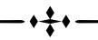
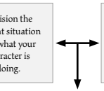
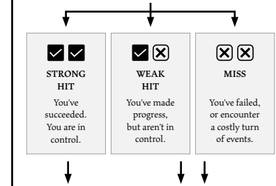
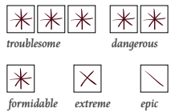
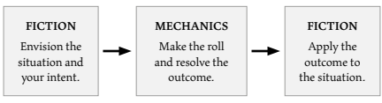

SOLO VAMPİRİC ROLEPLAYİNG
V 3

inspired by the world of Vampire: the Requiem Vampire: the Masquerade Vampire: the Masquerade - Bloodlines based on the rules of Ironsworn Starforged Reference Guide
(all found in www.ironsworn.com *and licensed under the* cc by 4.0 *license by author* Shawn Tomkin)

#### Pictures By

Aleksey Danilov, Aleksandar Pasaric, Alina Vilchenko, Almighty Shilref, Anni Roenkae, Artem Makarov, Berk Aktas, Brenda Timmermans, Cottonbro Studio, Craig Adderley, David Lyutov, Elijah O'Donnell, Elina Sazonova, Eloy Ediansyah, Engin Akuyrt, Erik Karits, Erik Mclean, Faruk Tokluoğlu, Faizi Ali, Freepik, Fxquadro, Huy Phan, Itzyphoto, Jonathan Alexis, Junior Teixeira, Kei Scampa, Ketut Subiyanto, Khoa Võ, Lexi Lauwe, Lil Artsy, Losa Fotios, Maria Luiza Melo, Maria Varshavskaya, Mario Cuadros, Maurício Mascaro, Mikhail Nilov, Mikoto.raw, Myco Libot, Myicahel Tamburini, Natacha Panassol, Nikita Skripnik, Ozan Çulha, Paul Volkmer, Pawel, Pierre Blaché, Racool Studio, Ron Lach, Ruslan Cəfərzadə, Ryangs, Sandro Tavares, Svetlana Sudarynya, Teksomolika, thanhhoa tran, Tomas Anunziata, Umar Mukhtar, Wendy Wei, Yuri Manei, Zhang Kaiyv, Zetong Li.

helped by Wolfcanic (playtest) ruan.oliver (general feedback) u/Rolletariat (feedback on negative focus rules) pommesflasche.itch.io (feedback on writing and rules explanation) all the awesome folks who gave me inspiration at Itch.io Elegy is a Miracle M game licensed under the cc by 4.0 *license*.

Thank you! Moro de Oliveira (Miracle M)
www.miraclem.itch.io/elegy moro9495@gmail.com u/miraclem

# Contents

| CHAPTER I:                  | CHAPTER V:                 |
|-----------------------------|----------------------------|
| INTRODUCTION                | NPCS                       |
| Welcome  5                  | NPCs  87                   |
| Fiction & Rules  5          | Mortals  90                |
| Elegies  5                  | Average Vampires  92       |
| Your vampire  6             | Olympus  94                |
| CHAPTER II:                 | Agorean Movement  96       |
|                             | Circle of Circe  100       |
| YOUR CHARACTER              | Epitaph Order  102         |
| Name  9                     | Crystal Compass  104       |
| Stats  9                    | Varou  107                 |
| Assets  9                   | Lycanthropes  109          |
| List of assets  12          | Beast People  111          |
| Background Connections      | 28 Mortal Threats  112     |
| Condition Meters  28        |                            |
| Creation Summary  29        | CHAPTER VI:                |
|                             | GAMEPLAY IN DEPTH          |
| CHAPTER III:                | The First Session  115     |
| PLAYING THE GAME            | Fiction and Mechanics  122 |
| The Flow of Play  31        | Quests  129                |
| The Action Roll  31         |                            |
| Progress tracks  37         | CHAPTER VII:               |
| Harm, stress and hunger     | ORACLES 40                 |
| Using oracles  42           | Names  133                 |
| Other Characters  43        | General  134               |
| Multiplayer  43             | Characters  135            |
| Optional Rule: Moves  44    | Story  136                 |
|                             | Ambience  139              |
| CHAPTER IV:                 | Location  141              |
| YOUR WORLD                  |                            |
| Basic setting  59           |                            |
| Your Truths  62             |                            |
| Lineages  76                |                            |
| The City of Santa Maria  79 |                            |

CHAPTER I: 
INTRODUCTION

## Welcome

Elegy is a solo role playing game about being a vampire and surviving the big city nights while you hide your nature from mortals and prey on them to satiate your relentless hunger. You will hunt for blood to keep your vicious fury at bay, play your role in maintaining the secrecy of the vampire society, gamble what's left of your humanity and fight the deadly creatures that stand in your way. To play it, you create your vampire, make some decisions about the world you inhabit, and set the story in motion. When you encounter something dangerous or uncertain, your choices and the dice determine the outcome. Unlike other traditional role playing games, no GM is necessary. You portray a lone character in a dangerous world. A session can be as long as you like, from a few minutes to a few hours.

### What You'Ll Need

 Two ten-sided dice (d10). 

 A character sheet.

 Counters for marking status tracks on your character sheet (paper clips, beads, coins, etc.)

## Fiction & Rules

Elegy uses various mechanics, such as rolling dice and managing the stats and resources on your character sheet, but is also heavily reliant on the fiction, which is the imagined characters, situations, and places within your game. You will play from the perspective of your character and interpret actions and events in a way that is consistent with the dramatic, fictional reality you have forged for your story and your world.

## Elegies

An elegy is a type of song that expresses sorrow, lamentation, or mourning for the death of individuals, groups of people, or even abstract concepts. In vampire society, it can also mean a special demonstration of profound respect. To sing an elegy means to promise to accomplish something in dedication to a person or ideal. The act is a reverence to the eternal grief born from the certain demise of every soul that leaves a vampire behind; a vow vampires make each other, or themselves, over their own mourning. The biggest ordeal a vampire faces might be not the insatiable hunger, the deadly sunlight, or blending in among mortals, but the eternal grief she feels for her life, now lost forever. A whole world of relationships, plans, and dreams was killed, and its place seized by the obligation to the Façade and the nature of a monster. To vampires, death is truer than life, and grief is eternal, and that's why they swear on theirs.

## Your Vampire

### A Creature Of The Night

Most people live out their lives oblivious to the unnatural powers that surround them after dark, but you are different. You were turned into a vampire and thrown into a life of secrets, danger, shadows, and blood deep inside the heart of your city. Before you jump into the mechanics of your character, consider her motivations, interests, skills, personality, and weaknesses. It's fine to start with one or two ideas about your background and goals. You can flesh out your character as you play. 

### Your Sheet

You use your character sheet to track your stats, abilities, overall condition, and progress in your quests and bonds. However, your character is more than these mechanical bits. 

You are the protagonist in a rich story. You have hopes and fears, virtues and failings. Not only that, but you have a history. You are, or were, part of a community. This is the fiction of your character. Consider a few of these details as you create your character, but don't sweat it. You'll evolve it through play. At the start of your game, put your character on stage to see what happens. Fill in the blanks—for your character and your world—as you go.

### Be Awesome

Your character is highly competent. You're intelligent, apt, and driven. You can count on yourself to survive the night. When you sing an elegy, you mean it. You are not without your limitations. You'll face hardship. You'll make bad decisions. You will fail. Overcoming those failures, pushing on, is what makes you the cool predator you are.

### Be Who You Want

You can envision your character however you like, unbound by geography, lineage, sexual orientation, and gender. Your character can be inspired directly by a real-world or historical culture, or you might weave a blend of cultural influences into your concept.

6 CHAPTER II: 
YOUR 
CHARACTER

## Name

You have a name. Perhaps vampire historians will treat it with high esteem someday.

## Stats

There are five stats. Each is given a value from 5 to 7. When you roll dice, you usually compare them to one stat - the situation will tell you which one, or give you a choice. To start, arrange these bonuses across your five stats in any order: 7, 6, 6, 5, 5.

 **Force:** Physical strength, endurance, and aggressiveness.

 **Dexterity:** Quickness, agility and coordination.

 **Glamour:** Charisma, influence and charm.

 **Intellect:** Expertise, knowledge and observation.

 **Heart:** Empathy and willpower.

If you're looking for musical inspiration for your character creation process, check out the official Elegy spotify playlist, Songs to create vampires to

## Assets

Assets represent your abilities, background, skills, traits, and resources. When you create your character, you pick three assets. Assets may grant three different types of advantages:
 A bonus to a stat on action rolls Special abilities and fictional opportunities Using one stat in place of another on a roll

### Acquiring Assets

As you form bonds and conclude quests, you gain experience. For a few experience points, you can purchase a new asset or buy a new ability on an asset you already own. Always consider the narrative justification when you add an asset to your character. What have you done to gain these abilities? How have your goals changed to support this new focus? Make your selection meaningful in the context of your story. Power assets are assets are vampiric abilities that are developed by vampires while they sleep. Nature assets can only be chosen during character creation. Ritual assets are sorcery rites that can only be learned from very powerful vampires.

Assets cost 3 xp to buy and 2 xp to upgrade. When you upgrade an existing asset, do it in whatever order you like; you can buy the third ability before the second one, for example. Just notice your setting affects which assets are available in your game (see Truths). For example, you cannot choose a *ritual* asset if your game doesn't feature vampiric magic.

 **Acute Senses:** *Power*. 

Supernatural boost to senses.

 **Agility:** *Power*. Supernatural boost to agility.

 **Animal Drinker:** *Nature*. 

Ability to drink from animals.

 **Articulate:** Ability to use your intellect to persuade others.

 **Artist:** Talent and affinity for performance and art.

 **Awe:** *Power*. Radiate an aura of majesty.

 **Bagger:** Access to and storage of blood bags.

 **Blood Alchemy:** *Power*. 

Turn blood into dangerous substances.

 **Buff:** *Power*. Supernatural boost to strength and stamina.

 **Cutthroat:** Skill with bladed weapons.

 **Decay:** *Power*. Weaken and destroy bodies.

 **Driver:** Driving skills.

 **Empath:** Empathy and peoplereading skills.

 **Fame:** A cult celebrity status. **Familiar:** *Power*. Turn dead animals into familiars.

 **Fierce:** Bare-handed fighting skills.

 **Gunslinger:** Shooting skills. **Ghost Whisperer:**
Communicate with ghosts.

 **Heart breaker:** Seduction and glamour skills.

 **Home Invader:** Larceny and security skills.

 **Horrendous:** *Nature*. 

A monstrous, atrocious appearance.

 **Hunting Field:** A favorite place to hunt.

 **Hypnosis:** *Power*. Subdue others' will and manipulate them with words.

 **Illusion:** *Power*. Project things that aren't there.

 **Lair:** A comfortable place to hide and sleep.

 **Lore Keeper:** Research skills and affinity for knowledge.

 **Lunacy:** *Power*. Make people lose touch with reality.

 **Magnetism:** *Power*. 

Supernatural boost to charisma.

 **Mannequin:** A mortal devoted to giving blood to you.

 **Marked:** You are hunted by a power or authority.

 **Mutation:** *Power*. Transform the substance of your body.

 **Path of the Demon:** *Ritual.* 
Rites of cruelty.

 **Path of the Eye:** *Ritual.* Rites of insight.

 **Path of the Guardian:** *Ritual.* 
Rites of protection.

 **Path of the Pursuer:** *Ritual.* 
Rites of hunting.

 **Path of Radiance:** *Ritual.* Rites of sunlight adaptability.

 **Path of the Spider:** *Ritual.* Rites of curses and fatality.

 **Path of the Tongue:** *Ritual.* 
Rites of communication.

 **Picky Taste:** *Nature*. Craving for a specific kind of blood.

 **Reanimation:** *Power*. Reanimate dead bodies.

 **Resilient:** Self wound healing skills.

 **Seer:** Insight and intuition.

 **Shadow Touch:** *Power*. Control and manipulate shadows.

 **Sixth Sense:** *Power*. Pick up psychic impressions from your surroundings.

 **Stalker:** Stealth and stalking skills.

 **Technomancy:** *Power*. Magically interact with electronic devices.

 **Terror:** *Power*. Exude a disturbing aura.

 **Veil:** *Power*. Turn invisible or magically disguise yourself.

 **Weak Blood:** *Nature*. You look human and daylight doesn't harm you, but you have no fangs.

 **Weather Command:** *Power*. 

Control weather.

 **Wilderness:** *Power*. 

Supernatural affinity with beasts.

### Narrative Requirements

Narrative circumstances may force you into situations where you can't leverage a key asset, making your adventure more challenging and dramatic. Before you act using an asset, take a moment to ensure you are properly positioned and equipped to use those abilities.

### Equipment

In Elegy, you won't worry too much about equipment. You are dressed and equipped appropriately to your vision for your character. Make note of any important possessions or items you start with. These are things that might impact the narrative, or provide texture to your character's background. They don't offer mechanical bonuses unless they are represented by an asset; for example, when you possess a blade and the Cutthroat asset.

## List Of Assets

### Acute Senses

8 *Power, intellect.* When you try to notice or find something with your senses, you may sacrifice blood (1-5) to gain an equal amount of bonus on your roll. The blood you spend to activate this power counts to the bonus.

Q
 When you do it, you may lose 1 more blood to re-roll any dice.

Q
 Take +2 focus on a hit.

### Agility

8 *Power, dexterity.* When you perform a feat of supernatural agility, coordination or speed, you may sacrifice blood (1-5) to gain an equal bonus on your roll. The blood you spend to activate this power counts to the bonus.

Q
 When you do it, you may lose 1 more blood to re-roll any dice.

Q
 Take +2 focus on a hit.

### Animal Drinker

8 *Nature.* Unlike most vampires, you are able to feed on the blood of animals. Big animals (large dog, cow) don't need to be killed to feed you, but small ones (bat, rat) do, and these restore only 1 blood.

Q
 You instinctively know how beasts behave. When you act based on your knowledge of animals, add +1 and take +1 focus on a hit.

Q
 If the body of an animal has blood in it, you can feed on its flesh instead of only drinking blood. When you do it, restore +1 blood.

### Articulate

8 You have a witty and charming way with words. When you roll to persuade or socialize in a situation that requires +glamour, you may instead roll +intellect.

Q
 When you do it, add +1 and take 
+1 focus on a hit.

Q
 Your words are profound and reach deep within people. When you roll to persuade or socialize in a situation that requires +heart, you may instead roll +intellect.

### Artist

8 When you present a work of art you've created or perform for an audience, roll the adequate stat, add +1 and take +2 focus on a hit. On a strong hit, also add +2 (one time only) if you interact with someone in the audience. 

Q
 If you drink blood from someone you performed to or who has seen your art, restore full blood.

Q
 You can find deep meaning within art. When you analyze a work of art, choose your approach:
 **Look for insight:** Roll 
+intellect and add +1. On a hit, envision (or ask the oracle for) what helpful truth, concept or idea it revealed to you, and take +2 focus.

 **Look for comfort:** Roll 
+heart and add +1. On a hit, envision (or ask the oracle for) what comfort the experience brought to you, and restore +3 spirit.

### Awe

8 *Power.* You are capable of radiating a supernatural aura of coolness, power and majesty that draws undivided attention to you. You gain +1 forward when you act to make an impression on your audience.

Q
 You can project this aura to anything, not just yourself.

Q
 The attention of a crowd is very meaningful and important to you. When you Awe, you always gain +2 spirit on a strong hit.

### Bagger

8 Thanks to contacts in hospitals, you can get 2 blood bags per week. When you drink from one, roll +force. On a strong hit, restore 2 blood. On a weak hit or a miss, restore only 1.

Q
 You have the equipment and skills needed to collect blood. When you take blood from a victim (that could be hypnotized, dying or willing), gain 1 extra blood bag.

Q
 When you resupply your blood bag stock from your hospital contacts, roll a die. On an even number, you get 3 blood bags. On an odd, you get 4.

### Blood Alchemy

8 *Power, force.* You can turn your blood into acid and shed it through shallow cuts in your veins.  It will corrode most surfaces and destroy small items. 

Q
 You can turn your blood into a paralyzing poison, which can be injected or drunk, that will affect both mortals and vampires. The victim stays immobilized for one scene. 

Q
 You can heat a mortal's blood. 

When you face a foe, you may spend blood and deal equal harm to the blood spent.

### Buff

8 *Power, force.* When you perform a feat of supernatural strength, stamina or toughness, you may sacrifice blood (1-5) to gain an equal amount of bonus on your roll. The blood you spend to activate this power counts to the bonus.

Q
 When you do it, you may lose 1 more blood to re-roll any dice.

Q
 Take +2 focus on a hit.

### Cutthroat

If you wield a bladed weapon...

8 When you are in position to attack an unsuspecting foe, choose one before rolling.

 Add +2 and take +1 focus on a hit Inflict +2 harm on a hit Q
 When you intimidate someone at the point of your blade, or when you rely on your blade outside of battle, add +1.

Q
 Once per fight, when you perform a feint or misdirection, re-roll any dice and take +1 focus on a hit.

### Decay

8 *Power, force.* With the power of your mind, you can engulf a corpse in flames and turn it into a pile of dust in a few moments.

Q
 You can cripple a foe's body part, weakening it as if it was 100 old, for one scene. In combat, roll +intellect and deal x2 harm.

Q
 You can make living people look dead for one scene. You need one minute of concentration to perform this.

### Driver

8 You have a vehicle. When you drive fast or dangerously, add +1 and take +1 focus on a hit. On a strong hit with a match, take +1 focus.

Q
 When you roll to maneuver your vehicle and burn focus to improve your result, roll a die. On a 9, 8 or 0, you don't have to reset your focus.

Q
 When you attempt something dangerous by taking a hit or crashing through an obstacle, you may reroll any dice. If you do, take +1 focus on a hit.

### Empath

8 When you look into the eyes of someone and try to read their intent or emotions, add +1 and take +1 focus on a hit.

Q
 As above, and if you score a hit as you read them, you may subtly influence their attitude or actions, such as making a hostile being hesitate. Take another +1 focus. If in a fight, mark progress.

Q
 When you attempt to soothe a being's distress through empathy, roll +heart and take +1 focus on a hit. 

### Fame

8 People from a specific subculture know and praise you (for your skills, deeds, looks, etc.). When dealing with someone who's already impressed by you, add +1 to all glamour rolls. On the other hand, take -1 whenever you need to remain anonymous or hide your presence in public settings.

Q
 When you spend time talking to a fan or reflecting on your fame to boost your self-confidence, take another +2 spirit on a strong hit (+4 instead of +2), or +1 on a weak hit (+3 instead of +2).

Q
 When you make a Conclusion Roll to create a bond with someone who's impressed by you, take +2 focus and reroll any dice.

### Familiar

8 *Power, intellect.* When you drain a small animal (cat, owl, raven, dog…) of its blood and feed him yours, its corpse comes back to life as a familiar for one week and efficiently obeys simple, single word commands.

Q
 When you use your familiar's keen senses to track something or investigate a place, add +1 and take +1 focus on a hit.

Q
 When you fight alongside your familiar and score a hit, inflict +1 harm or take +1 focus.

### Fierce

8 When you attack using your sharp teeth and claws as a weapon, you may add +2. If you do (decide before rolling), inflict +1 harm on a strong hit and count a weak hit as a miss.

Q
 When you do it and score a hit against a mortal, you also gain +1 blood. On a match, gain +3.

Q
 When you attempt to feed on someone by assaulting them with brute force, or when you try to disarm, trip, shove, grapple, or stun your foe, add +1 and take +1 focus on a hit.

### Gunslinger

If you wield a gun...

8 When take a moment to aim before shooting, choose your approach and add +1.

 **Trust your instincts:** Roll 
+intellect, and take +2 focus on a strong hit.

 **Line up your shot:** Roll 
+dexterity, and take +1 focus on a hit.

Q
 Once per fight, you may take extra shots and suffer -2 focus (decide before rolling). When you do, re-roll any dice. On a hit, inflict +2 harm and take +1 focus.

Q
 When you intimidate or persuade someone while armed, add +1 and take +1 focus on a hit.

### Ghost Whisperer

8 You are able to communicate with the dead. When you approach a corpse, you may talk to their spirit for up to one scene as if it was a living person. They may share information or insight, but spirits often speak in cryptic ways.

Q
 You may command a ghost to do as you say. Roll +force. On a strong hit, they will obey three orders. On a weak hit, they obey one. On a miss, they don't. Ghosts can move objects, manipulate electronic devices, and speak to people.

Q
 You don't need the corpse of someone to talk to their ghost. Once per session, you may call one ghost from the underworld and speak with them just as if their body was lying in front of you.

### Heart Breaker

8 When you act by being seductive, add +2. On a strong hit with a match, your charm creates an unexpected opportunity; take the value of your glamour as +focus.

Q
 When you charm your way out of a situation and burn focus to gain a strong hit, take +1 focus after you reset. If you envision how this momentary success leaves you fated for future trouble, gain 1 xp.

Q
 When you feed from someone you seduced, you gain other +2 blood (restoring +4 in total).

### Home Invader

8 When you break into a protected area or hack a secure system, add +1 and take +1 focus on a hit. On a strong hit with a match, access is easier than expected; take another +1 focus. 

Q
 When hunting or feeding inside the place you are invading, reroll any dice.

Q
 When you search a secure area after any kind of useful information with observation, you may re-roll any dice.

### Horrendous

8 *Nature.* Vampirism turned your body into an atrocious version of what it was in life. Your glamour is reduced by 1, but you gain +1 and take +1 focus on a hit when you intimidate, scare, hide or sneak.

Q
 You relish the repulse you inspire in others. When you scare or intimidate based on your looks, take +1 spirit on a hit, and +3 on a match.

Q
 Your lonely existence gave you deep insight into the human soul. When you attempt to read someone's true intentions or feelings, re-roll any dice.

### Hunting Field

8 You have a favorite place to hunt (a building, a square, a small park, a shop). When you attempt to feed within it, add +1 and take +1 focus on a hit.

Q
 When you attempt to hide, sneak or observe someone or something within your hunting field, add +1 and take +1 focus on a hit.

Q
 When you spend time and relax in your hunting field to recover spirit, gain +2 spirit (+4 total).

### Hypnosis

8 *Power, glamour.* When you meet a victim in the eyes, you may give it a simple command that will be obeyed instantly ("leave", "follow", "grab") unless it's harmful or impossible ("die", "fly"). The victim goes into a trance until right after the action, and won't recall the incident.

Q
 Your command can be complex 
("take this car and drive to this address at this time this day of the month") and have an activation trigger ("...when you hear the word Genesis").

Q
 You may give a suggestion that reshapes the memories of the victims ("You couldn't be in the crime scene because last Saturday morning at 8am you went to the grocery store to buy milk and eggs to bake a cake"). The more detailed the suggestion is, the more effective.

### Illusion

8 *Power, glamour.* For one scene, you can conjure a static illusion that has no actual solid presence and confuses one sense (a stench, a sound, a tattoo, etc.).

Q
 Your illusions may appeal to all senses (you can make a cup of hot water feel like a glass of cool champagne).

Q
 You can create illusions with motion (person, running water, living being, fire).

### Lair

8 You have your own place to sleep. It's not much, but it beats abandoned buildings. Whenever you awaken after spending a day resting in your lair, roll +heart. On a hit, gain +1 spirit. On a match, also gain +1 health.

Q
 Your lair is very presentable. 

When you attempt to bring a victim to it, add +1 and take +1 focus on a hit.

Q
 Your lair is full of useful stuff. 

When you search for an useful object or tool inside it, add +1 and take +1 focus on a hit.

### Lore Keeper

8 When you make a Conclusion Roll to finish a quest to recover valuable knowledge or an extraordinary relic, take +2 focus. You may re-roll any dice.

Q
 When you conduct extended research or study, re-roll any dice. On a match, you piece together an extraordinary or harrowing new theory; envision the nature of this revelation and take +1 forward if you act on it.

Q
 When you recall esoteric knowledge to your advantage, add +1. On a hit, envision the obscure but helpful fact, theory, or technique you put to use, and take +1 focus.

### Lunacy

8 *Power, glamour.* You are able to heighten or dull someone's current emotions (turn mild irritation into violent rage, or obsession into disinterest).

Q
 You can disturb someone's senses with flashes of content of their unconscious that will make them lose touch with reality for one minute.

Q
 You can make your victim mistake theirs or others' identity. For example, you can make someone think they're Napoleon, or think her wife is secretly an alien in disguise. This effect lasts for one scene.

### Magnetism

8 *Power, glamour.* When you impress or attract someone, you may sacrifice blood (1-5) to gain an equal amount of bonus on your roll. The blood you spend to activate this power counts to the bonus.

Q
 When you do it, you may lose 1 more blood to re-roll any dice.

Q
 Take +2 focus on a hit.

### Mannequin

8 You have a reliable source of blood in a mortal fascinated by you. They swore to keep your secret and be readily available whenever you are hungry. If they die and you want another mannequin, you have to pick this asset again from the start, but you may buy it for 1 xp.

Q
 Your mannequin trusts you way more than they should. When you gather info about the mortal world by speaking to your mannequin, you may re-roll any dice.

Q
 Having a steady source of blood brings you peace of mind. When you feed from your mannequin, take +1 spirit on a hit, and +2 spirit on a match.

### Marked

8 You are hunted by a power or authority. When you score a weak hit, you may improve the result to a strong hit. If you do, fill one segment of a four-segment progress track to represent hunters closing in. When the track is filled, a notable foe or force has tracked you down. If you overcome them or escape, reset the track and gain 1xp.

Q
 When you act by hiding, concealing your identity, or fleeing from a pursuer, add +1 and take +1 focus on a hit.

Q
 When you finish a quest by clearing your name or defeating the power or authority who marked you as a fugitive, gain this ability at no cost. You may then exchange this asset for another with the same number of marked abilities.

### Mutation

8 *Power, force.* You can merge with the earth below you for one scene. You can still feed if blood falls into the ground where you are. You can also climb walls without difficulty.

Q
 In this scene, you can turn into an animal (a bat, a wolf, a crow, a snake, etc.) for as long, and as many times, as you want.

Q
 For one scene, you are able to turn your skin into a scaly hide that grants you +1 in rolls to defend against damage.

### Path Of The Demon

8 *Ritual.* When you mix your blood with dirt and allow it to sit for a few hours, you create a poison lethal to mortals. Those who consume it will die in their sleep, peacefully, seemingly from natural causes.

Q
 When you pour a few drops of your blood into a vial of water and utter magical words, you transform the liquid into a drug capable of incapacitating a vampire for an entire night. The drug can be injected or ingested.

Q
 You can extract the soul of a victim from her body and transfer it permanently into one of her possessions, transforming it into a haunted and cursed object. When you unite her fresh corpse with a cherished possession of hers and sing magic words around it, the effect is activated. The object will interfere negatively on any action performed in its vicinity, except for you.

### Path Of The Eye

8 *Ritual.* When you place crossed bones and skulls at every entrance of a room (including windows and other openings) and seal them with a glyph drawn in your own blood, you ensure that every question asked within the room receives a truthful and immediate answer.

Q
 When you draw a circle in blood and walk around it, you are able to witness events from up to five years ago in that area.

Q
 When you mix a drop of your blood in a small pool of other and utter magic words while holding the possession of a target, you are able to hear and see the surroundings of the observed through the water until you leave.

### Path Of The Guardian

Ritual. When you draw a circle in blood and chant magic words, the area will magically repel… 8 …mortals and animals.

Q
 …supernatural living creatures.

Q
 …vampires and the undead.

If you possess more than one point of this asset, you can choose to repel only certain types of creatures. For instance, even with points 1 and 2, you can opt to repel only supernatural living creatures if desired.

### Path Of The Pursuer

8 *Ritual.* When you let blood flow from the palms of your hands, you can fashion a whip. When employed in combat, treat it as a heavy impact weapon (refer to Harm on page 40).

Q
 When you touch the center of your chest with red-hot metal, it renders your heart impervious to a stake for one night. Endure 2 harm.

Q
 When you submerge a pebble in blood and recite magical words, you transform the stone into a tracking device that always reveals in which direction it is. The effect persists until the pebble is destroyed.

### Path Of Radiance

8 *Ritual.* When you extinguish a candle with blood, you are granted the ability to withstand fatigue induced by daylight. You can remain awake for an entire day, needing rest only in the subsequent sunlight.

Q
 When you sleep in a brightly lit location, you can reverse your sleep cycle. Now, you awaken at dawn and rest at dusk The effects endure until you sleep in a dark place.

Q
 When you awaken the powers of your blood to appear human while reflecting on a potent memory of your mortal past, you extend the effects to 24 hours instead of just one scene.

### Path Of The Spider

8 *Ritual.* When you wash your face in blood and speak the name of a victim, she will experience intense hunger. A vampire will be induced to starvation, and will act out of instinct, impulse and hunger.

Q
 When you burn a piece of paper marked with your bloody hand print and say the name of a vampire within a one-kilometer radius, the victim will lose the reanimating power of blood and turn into a corpse for a whole night.

Q
 This ceremony is only potent against living entities. By burning a strand of hair, a nail clipping, or any other refuse from the subject's body, and uttering mystical incantations, a curse is placed that can be activated at will. Upon activation, the victim's throat splits, and their bowels forcefully expel from their body, leading to almost certain death, even with immediate medical intervention.

### Path Of The Tongue

8 *Ritual.* When you inscribe a message in blood on a piece of paper and utter the recipient's name, the message manifests before her. It may appear on any solid surface within their sight (a desk, a mirror, another piece of paper) and vanishes upon being read.

Q
 When you meditate silently for 30 minutes while repeating the name of someone with whom you share a blood link (or your progenitor) you can communicate telepathically with her for one scene.

Q
 When you set fire to the tongue of a victim, you gain the ability to comprehend all languages she knows. This effect is permanent.

### Picky Taste

8 *Nature.* You always crave for the same specific type of blood (A-, blondes, doctors, leninists, etc.). Whenever you feed from this type, always restore full blood. Whenever you feed from other mortals, always gain -1 blood.

Q
 Experience made your stomach stronger. When feeding from mortals that are not your favorite type, you may suffer -1 spirit instead of gaining -1 blood.

Q
 You know your victims' habits like the back of your hand. 

When you roll to look for a mortal of your type to feed from, reroll any dice.

### Reanimation

8 *Power, intellect.* For one scene, you are able to reanimate a dead body and make it perform a simple function (dig a hole, lift heavy objects, walk there).

Q
 You can command the corpse to attack someone or something. When you fight alongside it, deal +1 harm and gain +1 focus on a hit.

Q
 You can make the corpse talk and behave as a very weird human being for one scene.

### Resilient

8 When you spend blood to heal yourself, choose one:
 Add +1 and take +1 focus on a hit Gain +1 health on a hit (+3 in total)
Q
 You have enough patience and stamina to take care of whatever wound you suffer, as long as you have at least a few hours and a comfortable place. When you burn focus to heal yourself, you don't need to reset it.

Q
 You have a high recovery rate. 

When you feed, you may exchange your gained points of blood for health.

### Seer

8 *Nature.* Once per day, you may envision experiencing a prophetic dream (ask the oracle for details). If you record the answer, and later face a situation which gives truth to the vision, take an automatic strong hit (one time only) when making acting on your foresight. Then, clear the prophecy. Only one prophecy can be active at a time.

Q
 When you focus or meditate to gain insight about a place, being, or situation, add +1 and take +1 focus on a hit.

Q
 When you score a strong hit as you socialize with a community or search a place, you may envision gaining sudden and unbidden insight about the location. If you do, take +2 focus.

### Shadow Touch

8 *Power, dexterity.* You can reshape, stretch or overlap shadows, or even separate them from their casting bodies. Your manipulation grants them a mystical density that can smother mortals.

Q
 You can create a cloud of pitchblack darkness that obscures all light and sound. The cloud is just large enough for you to hide in it.

Q
 The shadows are able to grab and restrain foes.

### Sixth Sense

8 *Power, intellect.* You can sense the intentions of people around you. When you are next to other individuals, you can awaken your powers to ask two of the following questions to the oracle. Then, add +1 and take +1 focus the next move related to the answer.

 Who's the weakest person in here?

 Who's most likely to harm me? Who's most likely to give me what I want?

Q
 You can read people's thoughts and memories. Once per night, you may psychically inspect the mind of someone next to you as if it were a book.

Q
 When you hold an object in your hands, you are able to pick up psychic impressions from it and learn who held it last and when it was last held.

### Stalker

8 When you attempt to follow someone in a crowd without being noticed, add +1 and take +1 focus on a hit.

Q
 The bonus now applies to any situation, not only crowds.

Q
 When you attempt to eavesdrop or watch someone, add +1 and take +1 focus on a hit.

### Technomancy

8 *Power, intellect.* You can cause an electronic device to malfunction for 1 minute.

Q
 You can mystically encrypt or decrypt a device's controls, making it inaccessible for everyone else. This also works on media (CD, flash drive).

Q
 Using only words, you can manipulate an electronic device remotely. The device will obey you even if you don't understand how it works. Of course, it won't do something it can't (a 3d printer will "print a stake", but will not "make coffee").

### Terror

8 *Power, force.* You are able to exude a deeply unsettling aura that disturbs those who make eye contact with you. When you make a roll to intimidate someone, you may release this aura and reroll any dice.

Q
 Your aura twists the victim's mind and cause frightening hallucinations. Take +2 focus on a hit.

Q
 You can project this aura to anything, not only yourself.

### Veil

8 *Power, dexterity.* You can become invisible for one scene. While invisible, when you hide, sneak or ambush someone add +1 and take +1 focus on a hit.

Q
 When you intentionally drop your veil to reveal yourself for dramatic or surprising effect, foregoing its further use in this situation, take +2 focus.

Q
 Instead of disappearing, you alter other people's perception of you and how they see you. You can appear as someone specific ("Uncle Joe") or as a reflection of subjective concepts that could mean one thing for each person ("Caring Old Lady", "The Woman of Your Dreams").

### Weak Blood

8 *Nature.* Your body reacts differently to vampirism. You can eat, drink water, have sex and appear human in other ways without spending blood. Daylight does not harm you, but you still feel tired during the day and must spend 1 blood for each day (not night) scene you play. You have no fangs and must rely on sharp objects to draw blood from your victims. When you feed from someone, you always lose 1 focus no matter the result of your roll.

Q
 In some ways, time brought you even closer to your late humanity and to the mortals around you. Whenever you communicate with or read the emotions of humans, add +1 and take +1 focus on a hit.

Q
 Your experience with your distinct nature shaped your presence differently than other vampires. Whenever you hide your vampiric nature from other vampires or even mortals, re-roll any dice.

### Weather Command

8 *Power, force.* You can conjure fog. 

When you hide or sneak within it, add +1 and take +1 focus on a hit.

Q
 You can make it rain. When it's raining and you roll to hide or sneak, you may reroll any dice. Take +1 focus on a hit.

Q
 You can make winds blow. 

When it's windy and you roll to protect against gunshots, you may reroll any dice. Take +1 focus on a hit.

### Wilderness

8 *Power, heart.* You understand beasts and communicate with them for one scene. You also see clearly in pitch black.

Q
 Being close to beasts strengthens your instincts. When you react or search by using your senses, you may roll +force instead of +intellect.

Q
 You can make your blood attract dangerous predators. When you do it and pour a few drops somewhere, beasts will immediately follow the smell and try to devour the blood.

## Background Connections

As you build relationships and complete quests in the service of others, you create connections. Connections provide narrative texture to your world by fleshing out other characters and communities. They give you places to return to, and people to reconnect with, when you don't know what to do. They also provide mechanical benefits in rolls. When you establish a new relationship with a character in your world, you track progress in a progress track that represents the development of your relationship and thrust. You can start your first section with up to three connections, but you must start with at least one: your progenitor - the vampire who turned you into one. 

For each connection you start with, you mark 1 progress according to their rank (this will be later explained in Progress Tracks.

## Condition Meters

Your character sheet has three condition meters: health, spirit, and blood. Their values are reduced when you face hardship, and increased when you recover adequately (see Harm, Stress and Hunger). They start at +5.

 **Health** represents your physical condition and stamina.

 **Spirit** is your morale and mental state.

 **Blood** represents how much your hunger for blood is sated.

### Impacts

Impacts represent temporary and permanent disadvantages. Each marked impact reduces your max focus by 1. Impacts also reduce your focus reset. If you have one marked impact, your focus reset is +1 (instead of +2). If you have more than one marked impact, your focus reset is 0 (instead of +2). Characters begin with all impacts unchecked.

#### Misfortunes

Misfortunes are temporary. They last until your character has adequate opportunity, resources, and time to recover.

 **Wounded** may be marked when you are at 0 health and suffer harm. You are severely injured.

 **Shaken** is marked when you are at 0 spirit and suffer stress. You are despairing or distraught. 

 **Starving** is marked when you are at 0 blood and lose blood. You are in a violent, hungry state. You lose 1 point of glamour and 1 of intellect.

#### Lasting Effects

Lasting effects are permanent. They forever impact your character through the focus adjustment and - more importantly - the narrative impact.

 **Permanently harmed** may be marked when you are *Wounded*, at 0 health, and suffer harm. You have suffered a wound that you must reckon with, such as the loss of an eye or hand, or bear physical scars that are a constant reminder of a harrowing incident. When this impact is marked, you have 0 health and you suffer more harm, you die your last death.

 **Traumatized** may be marked when you are *Shaken*, at 0 spirit and suffers stress. Your experiences have left you emotionally or mentally scarred. When this impact is marked, you have 0 health and you suffer more stress, your mind is forever lost.

 **Sinner** may be marked when you are *Starving*, at 0 blood and spend blood. You get so frenzied, you commit something that angers your ruler. Envision what it is and what she asks of you in exchange for letting you live. When this impact is marked, you have 0 blood and you spend more blood, you lose complete touch with your human side and turn into a beast.

## Creation Summary

Work through the following steps in whatever order you prefer.

 Envision your character. Choose a name.

 Set your stats by arranging these bonuses across your stats in any order: (7, 6, 6, 5, 5.)
 Set health, spirit, and blood to +5. Make note of any important equipment, weapon, or items.

 Set your focus to +2, your max focus to +10, and your reset to +2.

 Pick three assets (at least 1 power) Create up to three background connections. One must be with your progenitor.

 Set a background elegy, and give it a rank of formidable, extreme or epic. Then, envision your inciting incident and write a new elegy.

CHAPTER III: 
PLAYING 
THE GAME

## The Flow Of Play

Like most RPGs, you play from the perspective of your character. Your quests, and the characters and situations you encounter, will guide the fiction and the choices you make. When you have questions about what you find, how other characters in your world respond, or what happens next, you can go with what feels 

## The Action Roll

right. When you are seeking inspiration or want to put it in the hands of fate, you may ask the oracle. Use yes/no questions and the random prompts to generate interesting twists and new complications. Above all, if it's appealing, dramatic and fits the fiction, make it happen.

Whenever your character tries to do something dangerous, risky, challenging or dramatic, you have to make an Action Roll. Envision your approach and roll 2d10 (two ten-sided dice). Then, compare them to a stat (and other bonuses sometimes). The situation will tell you what stat to add. The total of your stat and any adds is your action score.

action score

There are three possible outcomes.

l l
 **Strong Hit:** Your action score beats (ties don't count) the value of both challenge dice. You succeed at what you are trying to do.

l f
 **Weak Hit:** Your action score beats only one of the challenge dice. You succeed, but with a cost or lesser effect.

f f
 **Miss:** Your action score doesn't beat either challenge die. You fail, or must make serious concessions.

Envision the current situation and what your 

START
Ask and answer questions about the world, other characters, and what happens next 
(or *check the oracle*).

When your action or the current situation triggers a roll, make that roll.

What do you do next?

What happens next?

### How To Make An Action Roll

If you act… With stealth, speed, or **coordination:** Roll +**dexterity**. With courage, willpower, or **empathy:** Roll +**heart**. With aggression, strength, or **toughness:** Roll +**force**. With charm, composure, or **manipulation:** Roll +**glamour**. With expertise, focus, or **observation:** Roll +**intellect**. And if you are aided by… **A useful related asset:** consider the bonus it gives you (if any)
 **Someone else:** add another +1 to your roll (or +2 if you share a bond).

Then, roll the dice.

l l You succeed. Gain 
+1 focus, envision the positive consequences of your action and choose a fitting benefit.

l f You succeed, but not without trouble. Gain +1 focus, select one fitting benefit and one fitting cost.

f f You fail. Envision the negative outcomes of your action and select one fitting cost.

#### Benefits

 **Your wounds are healed:** gain +2 health or clear Wounded impact.

 **You feed:** gain +2 blood (+4 if you kill your victim) or uncheck Starving.

 You're feel calmer and more motivated: gain +2 spirit or clear the Shaken impact.

 You create or seize an opportunity: you or an ally gain +2 in the next related Action Roll You achieve something cool or dramatic: gain another +1 focus You harm a foe, develop a connection or advance in an elegy: mark progress (see Progress Tracks).

#### Costs

 **You are harmed or tired:** lose health according to the situation (see Harm)
 **You are stressed, scared,** 
intimidated or despaired: lose spirit according to the situation (see Stress)
 You spend blood and get hungrier: lose 1 blood (see Hunger)
 You are put in disadvantage or in trouble: lose 1 focus

### Match

If the values on your challenge dice are the same, you've rolled a match. You can use a match as a prompt to add a twist, create a new complication, or introduce a new peril:
l l Introduce an interesting twist or new opportunity.

f f Introduce a tough negative outcome, complication, or danger. If you're not sure what a match means for the current situation, you can ask the oracle. If you're still stuck for an idea, move on.

### Focus

Your focus value goes from -6 to +10 and represents your inertia, luck, and confidence. Burning focus is a way to deliver a decisive result or avoid failure. When you have positive focus, after you make an Action Roll, you may replace your action score with your current focus value. After you burn focus, you must reset your focus by immediately adjusting your focus meter to your focus reset value. The default reset is +2. This value is reduced when you suffer an impact. If you have one impact marked, your focus reset is +1. If you have more than one impact marked, your focus reset is 0.

When you have negative focus, you must reroll any die that hits a score lower than your focus. For example, when you make a roll at -3 focus and score an 8 and an 1, you must reroll the 1. You only need to do this once - if you score an 1 again, count it as a hit.

### Using Powers

Vampires have two innate supernatural abilities: **healing their wounds** and **appearing human for one** scene. Besides these, a vampire has access to powers granted by the power assets she possesses. To use a supernatural ability or power, you make an Action Roll based on the asset's associated stat. When you score a weak hit or a miss, you are forced to spend 1 blood. When you score a miss, the power is activated, but you must select a second cost.

#### Healing

When you have a few moments to stay in place, you can focus your inner power to restore health. This situation triggers an Action Roll. On any success, you restore points of health or (one or the other) clear the Wounded impact.

#### Appearing Human

You can focus your inner power to give the appearance of life to your undead body for up to a whole scene. This way, you are able to trick other people into believing you are a mortal. When appearing human, you may talk to people without making them suspicious, have intimate relationships, drink and eat and digest food.

### Rituals

Depending on your worldbuilding decisions, you may or may not include Rituals in your setting. We'll explore this in depth in Chapter IV: Your World). Rituals involve step-by-step activities with gestures, words, and objects, activating special and more specific supernatural powers. Like regular powers from assets, they use your life force for their effects, but they need a more specific setup - one tailored to each ritual. During character creation, you can choose up to three non-power assets, including any ritual assets. Consider the impact on your character's story when making these choices. How did she learn this ritual? Where did she find out about it?

New rituals can only be learned when it makes sense in the story - like having a mentor or finding instructions in a book. This applies to both entirely new rituals and different versions of the same ritual within a specific asset. Most ritual assets represent a group of rituals rather than just one.In the narrative, the target of a ritual always feels something strange is going on. If she's a vampire, she'll know for sure one was cast upon her - even though she can't tell what it does. To use a supernatural ability or power, you make an Action Roll based on the intelligence stat. On a **strong hit**, the ritual is successful. On a **weak hit** it is too, but it consumes you: lose 1 point of blood, health or spirit (pick 1). On a **miss,** roll on the list below. 1-20. The ritual has the opposite effect 21-40. It attracts mortal attention 41-60. It affects a different target 61-80. It has no effect, and you waste or lose resource needed to perform it again 81-00. It has no effect, and it consumes you: lose 2 point of blood, health or spirit (pick 1).

### Tips For Action Rolls

#### Fiction First, Then Mechanics

What are you trying to do? How are you doing it? What complications might you face? Envision it. If, after thinking through the fiction, you decide you are doing something or encountering a situation that is risky, challenging, or dramatic, roll the dice. Depending on the scale of the current action, you might be visualizing a montage of flashes (a quick hunt to feed) or the passing of a mere second (an intense fight). Always think from the standpoint of the fiction, even if it's obvious you'll do. Then, translate the fiction into the mechanics of a roll, and back to the fiction again as you play out the result.

#### Not Every Action Must Be Rolled

Don't let a session jump from roll to roll without any roleplay, worldbuilding, or storytelling. If you're doing something safe and certain, you probably don't need to roll. If you'd rather gloss over something, do it. Rolls offer a potential benefit and cost, and it's ultimately your decision whether to risk the roll to gain the reward. 

#### Making Group Rolls

When you are adventuring with allies (other player characters), you will often act to resolve a challenge for the group. This represents your character taking the lead in a particular scene. You might serve as the spokesperson as you persuade someone, for example. Unless an action specifically offers benefits for your allies, any mechanical bonus you gain from a hit is applied only to the character making the action or Conclusion Roll. For example, if you represent your group as you conclude an elegy and score a strong hit, you take the mechanical reward. Everyone else benefits from the narrative success. Allies can contribute to your action by making an Action Roll to help you. On a hit, you gain a bonus you can leverage to improve your chance of success. If more than one ally does this, bonuses can be stacked. When you act for your group and face a negative outcome, you should apply mechanical and narrative costs as appropriate to the current situation.

#### Make Rolls Matter

Let your rolls flow organically out of the narrative. Don't make them purely for a mechanical benefit without some support in the fiction. Don't repeat a roll trying to get your desired outcome. A roll, hit or miss, should always result in a change to the current situation. For example, you are trying to persuade an influential vampire to agree to an alliance. You roleplay how you attempt to reason with her. Then, you make the roll, and fail. She refused. Why? What else do you learn, or what do they do to make your situation more complex or dangerous? Whatever happens, something happens. You shouldn't try to persuade her again unless you bring a new approach or leverage to bear. However, there will be times when you make a roll multiple times in 

## Progress Tracks

A progress track measures your headway against a goal or obstacle, including quests, connections, and fights. Progress is tracked in three different situations: **Combat:** When you face an enemy in combat, a progress track represents your advantage as you weaken or wound your foes in the fight.

 **Connection:** When you establish a new relationship with a character in your world, a progress track represents the development of your relationship and thrust. Give them a role: whenever your connection aids you on an action closely associated with their role, add +1 and take +1 focus on a hit.

 **Elegy:** When you Sing an Elegy, a progress track represents the sequence. For example, in combat, you'll often attack with consecutive rolls. That's fine as long as the rolls don't get too mechanical. Break up the flow of play with other actions, narrative beats, and events that cause you to rethink your approach. When in doubt, follow this guideline: If you've made the same roll three times in a row, switch things up.

challenges you overcome on your way to achieving your ultimate goal. 

When you create a progress track, give the challenge a rank. In increasing order of severity, the ranks are troublesome, dangerous, formidable, extreme, and epic. Progress tracks are drawn as a row of ten boxes, which you fill in—or mark—as you make headway toward a goal. When you initiate a challenge, these boxes are empty.

### Marking Progress

When you make significant progress, fill in the appropriate number of ticks or progress boxes per the rank of your challenge. **Combat:** Mark progress when you harm your foe.

 **Connection:** Mark progress when you: sing or conclude an elegy for them; give them something of worth; share a profound moment; leverage their help in desperate circumstances; stand with them against hardship; or overcome a test of your relationship.

 **Elegy:** Mark progress when you: 
overcome a critical obstacle; gain meaningful insight; acquire a crucial item or resource; earn vital support; or defeat a notable foe.

### The Conclusion Roll

When it feels like you've made enough progress to achieve the objective you're tracking, you may attempt to conclude it. This is a Conclusion Roll. Roll the dice and compare their value to the number of filled boxes in the track (ignore stats, focus, and bonuses). 

#### Strong Hit

 **Combat:** You've defeated your enemy, and their fate is in your hands.

 **Connection:** You now share a bond. Give it a title as a trophy, mark experience, and pick one:
 Give her a new role When she aids you, add +2 and gain +1 focus on a hit.

 **Elegy:** Your quest is complete. 

Give it a title as a trophy and mark experience.

#### Weak Hit

 **Combat:** You achieve your objective, but not for free. Envision an appropriate trouble, disadvantage, or loss that comes from the situation.

 **Connection:** You share a bond, but they request something from you. To mark experience for this bond, sing an elegy for them and fulfill it.

 **Elegy:** Your promise is fulfilled, but there's more to do. If you sing an elegy to set things right, take full xp. Otherwise, take -1 xp.

#### Miss

 **Combat:** You are defeated, or your objective is lost. Envision an appropriate, dire outcome.

 **Connection:** They reveal a motivation or background that puts you at odds. If you recommit to this relationship, clear half your progress boxes and raise the connection's rank by one.

 **Elegy:** The goal is lost to you. 

Envision an appropriate, dire outcome. This also happens if you abandon an elegy.

### Experience

When you conclude an elegy or create a bond, you gain experience ponts per the challenge's rank: Troublesome: 1 xp; Dangerous: 2 xp; Formidable: 3 xp; Extreme: 4 xp; Epic: 5 xp. You gain no experience by simply beating foes. You spend earned experience to gain assets or upgrade those you already own. When you upgrade an asset, you may choose the options in whatever order. In other words, you don't need the second point in an asset to get the third. Assets cost 3 xp to buy and 2 xp to upgrade.

#### Sample Progress Tracks Troublesome

 **Progress marked:** 3 boxes
 **Elegies:** Challenging quests with few obstacles
 **NPCs:** Newborn vampires and average humans
 **Experience awarded:** 1 point

#### Dangerous

 **Progress marked:** 2 boxes
 **Elegies:** Involving quests with lots of obstacles
 **NPCs:** Young vampires, capable mortals
 **Experience awarded:** 2 points Formidable
 **Progress marked:** 1 box **Elegies:** Complex quests with many intimidating obstacles
 **NPCs:** Adult vampires, dangerous mortals and young werewolves
 **Experience awarded:** 3 points

#### Extreme

 **Progress marked:** 2 ticks
 **Elegies:** Overwhelming quests of staggering proportions
 **NPCs:** Elder vampires and adult werewolves
 **Experience awarded:** 4 points

#### Epic

 **Progress marked:** 1 tick **Elegies:** Unlife-defining quests of unknowable scope
 **NPCs:** Ancient vampires and elder werewolves
 **Experience awarded:** 5 points

# Harm, Stress And Hunger

### Harm

Harm represents physical damage and injuries. How much harm you suffer depends on the situation. When you face physical injury or hardship, you reduce your health track by the amount of harm suffered according to the situation or the rank of your foe. In combat, you deal and suffer harm according to the rank of your foe. Each point of harm you inflict is marked as progress on your foe's progress track. **Troublesome:** suffers 3 boxes per harm, deals 1 harm
 **Dangerous:** 2 boxes per harm, deals 2 harm
 **Formidable:** 1 box per harm, deals 2 harm
 **Extreme:** two tick per harm, deals 3 harm
 **Epic:** one tick per harm, deals 3 harm When you successfully attack a foe, you inflict harm according to what kind of weapon you are using. **1x harm:** Improvised weapons, light impact
 **2x harm:** Sharp weapons, gunshot, heavy impact, fire For example, when you wield a knife (doubles your harm) and attack a Dangerous enemy (takes 2 progress boxes per harm), you inflict 4 progress boxes of harm on a hit. When you are at 0 health and suffer harm, you must mark the Wounded impact. If this impact is already marked, you must mark Permanently Harmed. If this other impact is already marked, you face your final death (see Impacts). To heal yourself, you must activate your supernatural powers (see Healing). You can also clear the Wounded impact by doing so, but you cannot do both in the same roll.

### Optional Rules

Depending on the decisions you make when building your world, (which we will delve into in Chapter IV: Your World) you may or may not include damage by holy water, garlic, etc. If you do so, consider the appropriate optional rule below.

#### Superstitions

When you opt to include superstitions in your universe, foes who use garlic, sacred symbols and holy water against you in combat are deadlier. When they deal damage, you suffer +1 harm. In other words, a troublesome foe who throws holy water at you deals damage as if it was dangerous.

#### Authentic Faith

Authentic Faith is a true and resilient belief in a higher power that you can choose to incorporate in your universe. If so, when a foe wield a symbol of a higher power they deeply believe in (a crucifix, for example), she is treated as she was one rank more powerful.

### Stress

Stress represents mental burdens and trauma. When you face hardships that test your psychological endurance, reduce your spirit track according to the situation. You also suffer stress when someone intimidates or frightens you.

 **1 stress:** An unsettling or frustrating incident.

 **2 stress:** A distressing or upsetting incident.

 **3 stress:** A horrifying or demoralizing incident.

 **4 stress:** A traumatic or heartrending incident.

 **5 stress:** A soul-shattering incident, loss of all hope.

When you're at 0 spirit and suffers stress, you must mark the Shaken impact. If this impact is already marked, you must mark Traumatized. If this other impact is already marked, you face desolation (see Impacts).

#### Respite

To recover spirit points or remove the Shaken impact (one or the other), you must make an action roll to socialize, share intimacy, or find a moment of peace.

### Hunger

Hunger represents how much a vampire feels the need to feed. They always spend 1 blood when scoring a weak hit or miss while trying to:
 Awake each sunset Appear human for a scene Use a supernatural power Heal wounds and restore health The hungrier a vampire is, the closer she is to losing her self-control and committing something that threatens the Façade.

When you have 0 blood and have to spend more, you must mark the Starving impact. If it is already marked, mark the Sinner one. If you already marked it, your mind is lost forever (see Impacts).

#### Feeding

To recover spirit blood or remove the Starving impact (one or the other), you must feed from mortals (or other sources, if you have adequate assets).

## Using Oracles

### Seeking Answers

You can ask the oracle to help guide your game session and trigger ideas when you need to know what happens next. Its most basic function is to answer a "yes or no" question. Combined with your own instincts and creativity, this (and other random prompts) can push your story in surprising and exciting directions. 

### Asking The Oracle

When you seek to resolve questions, discover details in the world, determine how other characters act, or trigger events, you may…
 **Draw a conclusion:** Decide the answer based on the most interesting and obvious result.

 **Ask a yes/no question:** Decide the odds of a 'yes', and roll on the table to the right to check the answer. 

 **Pick two:** Envision two options. 

Rate one as 'likely', and roll on the table to the right to see if it is true. If not, it is the other.

 **Spark an idea:** Brainstorm or use a random prompt.

#### Yes/No

| Odds are...    | Yes on...      |
|----------------|----------------|
| Almost certain | 11 or greater  |
| Likely         | 26 or greater  |
| 50/50          | 51 or greater  |
| Unlikely       | 76 or greater  |
| Small chance   | 91 or greater. |

On a match, an extreme result or twist has occurred.

### More Randomness

You'll find a set of random tables in the last chapter. These provide inspirational prompts and random results for common situations. You can also use whatever random generators you prefer, including those drawn from another game, online generators, or visual tools such as tarot cards.

### Trust Your Instincts

These random generators will never replace your own imagination and intuition. If it's interesting, dramatic, and pushes the story forward, make it happen. Too much reliance on random generators to answer questions about "what happens next" can kill the focus of your game or make it feel disconnected and incoherent. Keep it moving.

## Other Characters

The mechanics of Elegy almost entirely reference your character. Other non-player characters (NPCs) have a single stat (their rank) which represents how powerful or dangerous they are. Rank is taken into account when you fight or make a connection with NPCs. Further, NPCs do not roll dice to determine the outcome of their actions. If you have questions about an NPC's motivations or what they do next, ask the oracle.

### Connections

As you explore your world and complete quests, you create connections with people, which represent your current relationship. Connections give you advantages for relevant rolls when interacting with those you have connected with. Each connection is tracked in a progress track that's ranked according to the character's rank.

## Multiplayer

Elegy is primarily a solo game, but you can play it with more people if you want. There are two modes of multiplayer:
 **Guided:** One or more players take the role of their characters, the protagonists in your story, while a gamemaster (GM) moderates the session. The GM helps bring the world to life, portrays the characters you encounter, and makes decisions about the outcome of your actions.

 **Cooperative (Co-Op):** You and one or more friends play together to overcome challenges and complete quests. A GM is not required. The Elegy game system will help you explore the dramatic stories of your characters and their.

When multiple player characters share a same objective (a mission, for example), they also share the same progress track. You can see more insights on multiplaying Elegy in the Gameplay in Depth chapter.

# Optional Rule: Moves

Moves are, essentially, rolls adapted for specific narrative situations. You can use them, only if you wish, in place of Action or Conclusion Rolls when situations permit. For instance, if you're persuading someone, you can either make an Action Roll and adapt its benefits and costs to the scene or, if you prefer, opt for the *Compel* move. The difference lies in the fact that the Action Roll is a one-size-fits-all tool that can be performed in any context quickly; on the other hand, *Compel* offers a roll precisely designed for persuasion contexts, providing you with more ideas on how to navigate that specific situation. When you see a move name Italicized like this in another move's description, it means you have to make it. For example, every time you get a miss in a move, you'll be prompted to Pay the Price. That means that you'll have to make the *Pay the Price* move. Another difference in moves is that marking impacts or progress on a progress track is dependent on specific moves now. When you're prompted to mark progress, mark it on the track related to what you're trying to accomplish 
(see Progress Tracks).

### Adventure Moves

Face danger When you attempt something risky or react to an imminent threat, envision your action and roll. If you act…
 With **stealth, speed,** or coordination: Roll +**dexterity**.

 With **courage, willpower,** or empathy: Roll +**heart**.

 With **aggression, strength,** or toughness: Roll +**force**.

 With **charm, composure,** or manipulation: Roll +**glamour**.

 With **expertise, focus,** or observation: Roll +**intellect**.

On a **strong hit**, you are successful. Take +1 focus. On a **weak hit**, you succeed, but not without a cost. *Pay the Price*. On a miss, you fail, or a momentary success is undermined by a dire turn of events. Pay the Price.

#### Secure An Advantage

When you **assess a situation, make** preparations, or attempt to gain leverage, envision your action and roll. If you act…
 With **stealth, speed,** or coordination: Roll +**dexterity**.

 With **courage, willpower,** or empathy: Roll +**heart**.

 With **aggression, strength,** or toughness: Roll +force.

 With **charm, composure,** or manipulation: Roll +**glamour**.

 With **expertise, focus,** or observation: Roll +**intellect**.

On a hit, you succeed. On a strong hit, take both. On a **weak hit**, choose one.

 Take +2 focus Add +1 on your next roll (not a Conclusion Roll)
On a **miss**, you fail or your assumptions betray you. *Pay the Price*.

#### Gather Information

When you search for clues, conduct an investigation, analyze evidence, or do research, roll +**intellect**. On a **strong hit**, you discover something helpful and specific. The path you must follow or action you must take to make progress is made clear. Envision what you learn. Then, take +2 focus.

On a **weak hit**, the information provides new insight, but also complicates your quest. Envision what you discover. Then, take +1 focus. On a miss, your investigation unearths a dire threat or reveals an unwelcome truth that undermines your quest. *Pay the Price*.

#### Aid Your Ally

When you *Secure an Advantage* in direct support of an ally and score a hit, they (instead of you) can take the benefits of the move. If you are in combat and score a **strong hit**, you and your ally have initiative.

#### Compel

When you try to **persuade someone** 
or make them an offer, envision your approach. If you…
 Charm or lie: Roll +**glamour** Threaten or incite: Roll +**force**
 Pacify or encourage: Roll +**heart** On a **strong hit**, they'll do what you want or agree to your conditions. Take +1 focus. On a **weak hit**, as above, but their agreement comes with a demand or complication. Envision their counteroffer. On a **miss**, they refuse or make a demand that costs you greatly. Pay the Price.

#### 45 Use Power

When you **use your supernatural** abilities to activate a power, visualize the effects you want to manifest and roll the stat indicated in its asset card; if you use them to appear human for a scene (blushing, being able to have sex or consume food), 
roll +**Glamour**.

On a **strong hit**, the power is activated successfully. Take 1 focus. On a **weak hit**, the power is activated successfully, but you get hungrier. Spend 1 blood. On a **miss**, you get hungrier and the power is activated, but not without consequences. Spend 1 blood and Pay the Price.

#### Perform Ritual

To decide if you want to include rituals in your setting, see the Rituals Truths. When you perform a ritual of bood magic, envision what to want to achieve and how you perform it. Then, roll +**intellect**. On a **strong hit**, the ritual is performed successfully. Take 1 focus. On a **weak hit**, the ritual is performed successfully, but it consumes the blood within you. Spend 1 blood.

On a **miss**, the ritual consumes your blood and has undesired consequences. Spend 1 blood roll on the list below: 1-20. The ritual has the opposite effect 21-40. It attracts mortal attention 41-60. It affects a different target 61-80. It has no effect, and you waste or lose resource needed to perform it again 81-00. It has no effect, and it consumes you: lose 2 point of blood, health or spirit (pick 1).

#### Rest

When you spend the whole daytime in deep sleep in a dark place, roll +heart or +**intellect**, whichever is higher. By default, you need the Lair asset to have access to a secure place to sleep you can call yours. If you don't have it, you must sleep in abandoned places. On a **strong hit**, you rest well, and get both bonuses below: Restore 1 health Gain +2 focus On a **weak hit**, you have a regular day of sleep. Pick one of the bonuses above On a miss, pick one of the options below. On a match, pick both: You get hungrier: lose 1 blood You don't sleep well: lose 1 focus

#### Advance

When you focus on your skills, receive training, find inspiration or earn a reward, you may spend 3 xp to add a new asset, or 2 xp to upgrade one. The chosen asset must be framed within fiction and make sense in the context. For example, if you're by yourself without any access to blood sorcery knowledge, you can't learn or upgrade a ritual asset.

#### Heal

When you spend a few seconds in place and use your supernatural abilities to heal yourself, roll +force.

On a **strong hit**, the care is helpful. If you are wounded, clear the impact and take or give +2 health. Otherwise, take +3 health. Spend 1 blood. On a **weak hit**, as above, but the recovery costs extra time or resources. Choose one: lose 2 focus and spend 1 blood or spend 2 blood. On a miss, the aid is ineffective and the situation worsens. *Pay the Price*.

#### Respite

When you socialize, share intimacy, or find a moment of peace, roll 
+**heart**.

On a **strong hit**, you find companionship or comfort and your spirit is strengthened. If you are shaken, clear the impact and take +1 spirit. Otherwise, take +2 spirit. On a **weak hit**, as above, but this indulgence is fleeting. Envision an interruption, complication, or inner conflict. Then, lose focus (-1). On a **miss**, you take no comfort and the situation worsens. *Pay the Price*.

#### Feed

When you **attempt to drink blood** from a living being, envision the scene. If you act with…
 …brutality and physically overwhelm your struggling victim, roll +**force**.

 …speed or ambush an unsuspecting victim, roll +**dexterity**.

 …**charm or seduces** your victim, roll +**glamour**.

 …somehow manage to get your victim's consent, roll +**heart**.

On a **strong hit**, gain 1 focus and choose one:
 gain 2 blood and keep the victim alive gain 4 blood and kill the victim, but lose 3 spirit On a **weak hit**, do the same as above, but lose 1 focus instead of gaining it. On a miss, you are unable to feed due to an adversity. Pay the Price.

### Quest Moves

#### Sing An Elegy

When you **swear to complete a quest**, write your elegy and give it a rank. Then, roll +**heart**. If you make this promise to a connection, add +1; if you share a bond, add +2.

 On a **strong hit**, you are emboldened, and it is clear what you must do next. Take +2 focus.

 On a **weak hit**, you are determined but begin your quest with more questions than answers. Take +1 focus, and envision what you do to find a path forward.

 On a **miss**, you must overcome a significant obstacle before you begin your quest. Envision what stands in your way.

#### Reach A Milestone

When you make significant progress in your quest by overcoming a critical obstacle, solving a complex mystery, defeating a powerful threat, gaining vital support, or acquiring a crucial item, you may mark progress.

 Troublesome quest: Mark 3 boxes.

 Dangerous quest: Mark 2 boxes. Formidable quest: Mark 1boxes. Extreme quest: Mark 2 ticks. Epic quest: Mark 1 tick.

#### Fulfill Your Elegy

When you achieve what you believe to be the fulfillment of your promise, roll the challenge dice and compare to your progress. Focus is ignored on this roll. On a **strong hit**, your quest is complete. Mark experience (troublesome=1; dangerous=2; formidable=3; extreme=4; epic=5). On a **weak hit**, there is more to be done, or you realize the truth of your quest. Envision what you discover (ask the oracle if unsure). Then, mark experience (troublesome=0; dangerous=1; formidable=2; extreme=3; epic=4). You may Sing an Elegy to set things right. If you do, add +1. On a **miss**, your quest is undone. Envision what happens (ask the oracle if unsure), and choose one.

 You recommit: Clear all but one filled progress, and raise the quest's rank by one (if not already epic).

 You give up: Forsake Your Elegy

#### Forsake Your Elegy

When you renounce your quest, betray your promise, or the goal is lost to you, clear the elegy. Then, envision the impact of this failure and pick one or more as appropriate to the nature of the elegy. Any allies who shared this vow may also envision a cost.

 You are demoralized or dispirited: Lose spirit according to the situation (see Stress)
 A connection loses faith: Test Your Relationship when you next interact.

 Your supernatural abilities weaken drastically: Discard a power asset.

 You must abandon a path or resource: Discard an asset (not a power or nature one).

 Someone else pays a price: 
Envision how a person, being, or community bears the cost of the failure.

 Someone else takes advantage: 
Envision how an enemy gains power.

 Your reputation suffers: Envision how this failure marks you.

### Combat Moves

#### Enter The Fray

When you initiate combat or are forced into a fight, envision your objective and give it a rank. If the combat includes discrete challenges or phases, set an objective with a rank for each. Then, roll to see if you are in control. If you are… Facing off against your foe: Roll 
+**heart**
 In the thick of it at close quarters: Roll +**force**
 On the move or preparing to act against an unaware foe: Roll +**dexterity**
 Caught in a trap or sizing up the situation: Roll +**intellect**
On a **strong hit**, take 2 focus. On a **weak hit**, take 1 focus. On a **miss**, the fight begins with you in disadvantage. Lose 1 focus.

#### 49 Clash

When you fight against a foe at close quarters, roll +force; when you exchange fire at a distance, roll +dexterity.

 On a **strong hit**, mark progress twice. You overwhelm your foe.

 On a **weak hit**, mark progress, but you are dealt a counterblow or setback. *Pay the Price*.

 On a **miss**, your foe dominates this exchange. *Pay the Price*.

#### End The Fight

When you make a move to take decisive action, roll the challenge dice and compare to your progress. Focus is ignored on this roll. On a **strong hit**, this foe is no longer in the fight. They are killed, out of action, flee, or surrender as appropriate to the situation and your intent (ask the oracle if unsure). On a **weak hit**, as above, but you must also choose one.

 It's worse than you thought: 
Endure Harm.

 You are overcome: *Endure Stress*.

 Your victory is short-lived: A 
new danger or foe appears, or an existing danger worsens.

 You suffer collateral damage: 
Something of value is lost or broken, or someone important must pay the cost.

 You'll pay for it: An objective falls out of reach.

 Others won't forget: You are marked for vengeance.

On a miss, you have lost this fight. Pay the Price.

#### Battle

When you fight a battle, and it happens in a blur, envision your objective and roll. If you primarily…
 Fight **at range or using your** 
speed or trickery to your advantage: Roll +**dexterity**.

 Fight **depending on your** 
courage, leadership, or companions: Roll +**heart**.

 Fight **in close to overpower**
your foe: Roll +**force**.

 Fight using careful tactics to outsmart your foe: Roll +**intellect**.

On a **strong hit**, you achieve your objective unconditionally. You and any allies who joined the battle may take +2 focus. On a **weak hit**, you achieve your objective, but not without cost. Pay the Price. On a **miss**, you are defeated or the objective is lost. Pay the Price.

### Connection Moves

#### Make A Connection

When you search out a new relationship or give focus to an existing relationship (not an ally or companion), roll +**heart**. On a **strong hit**, you create a connection. Give them a role and rank. Whenever your connection aids you on a move closely associated with their role, add +1 and take +1 focus on a hit.

 On a **weak hit**, as above, but this connection comes with a complication or cost. Envision what they reveal or demand.

 On a miss, you don't make a connection and the situation worsens. *Pay the Price*.

#### Develop A Relationship

When a relationship with a connection is reinforced by…
 accomplishing a mission that benefits them seeking their assistance during dire situations presenting them with a valuable gift sharing a significant moment standing by them in times of hardship successfully navigating a test of your relationship 
…mark progress according to the rank of the connection.

#### Test Your Relationship

When your relationship with a connection is tested through conflict, betrayal, or circumstance, roll +**heart**. If you share a bond, add +1.

 On a **strong hit**, mark progress. On a **weak hit**, mark progress, but also envision a demand or complication as a fallout of this test.

 On a miss, or if you have no interest in maintaining this relationship, choose one.

 Lose the connection: Envision how this impacts you and *Pay* the Price.

 Prove your loyalty: Envision what you offer or what they demand, and Sing an Elegy (formidable or greater) to see it done. Until you complete the quest, take no benefit for the connection. If you refuse or fail, the connection is permanently undone.

#### 51 Form A Bond

When your connection with someone is ready to evolve, roll the challenge dice and compare the result with your progress. On a **strong hit**, a bond is established. Earn XP based on the connection's rank: troublesome=1 tick; dangerous=2 ticks; formidable=1 box; extreme=2 boxes; epic=3 boxes. This reward extends to all allies tied to this connection. Additionally, pick one:
 Reinforce their influence: When they support you in a move closely tied to their role, add +2 instead of +1. 

 Expand their influence: Grant them a second role. When they assist you in a move associated with either role, add +1 and gain +1 momentum on a hit.

On a **weak hit**, follow the same steps as above, but your connection seeks something more first. To form the bond and earn the XP reward, envision the request and fulfill it (or Sing an Elegy to guarantee its completion). On a miss, they reveal a motivation or background that introduces tension. If you decide to maintain this relationship, roll both challenge dice, take the lower value, and clear that number of progress boxes. Then, increase the connection's rank by one (if not already epic).

### Suffer Moves

#### Pay The Price

When you **suffer the outcome of an action**, choose one. Make the most obvious negative outcome happen. ask the oracle for inspiration. Interpret the answer as a hardship or complication appropriate to the situation.

 Roll on the list below. If the result doesn't fit the situation, roll again.

1–2. A trusted individual or community acts against you 3–4. An individual or community you care about is exposed to danger 5–7. You encounter signs of a looming threat 8–10. You create an opportunity for an enemy 11–14. You face a tough choice 15–18. You face the consequences of an earlier choice 19–22. A surprising development complicates your quest 23–26. You are separated from something or someone 27–32.Your action causes collateral damage or has an unintended effect 33–38. Something of value is lost or destroyed 39–44. The ambient introduces a new hazard 45–50. A new enemy is revealed 51–56. A friend or ally is in harm's way (or you are, if alone)
57–62. Your supernatural abilities malfunction 63–68. An asset is compromised 69–74. You waste blood 75–81. You are harmed 82–88. You are stressed 89–95. You are delayed or put at a disadvantage 96–100. Roll twice

#### Face A Setback

When **your focus is at its minimum** (-6), and you suffer additional -focus, choose one.

 Exchange each additional -focus for any combination of -health, -spirit, or -blood as appropriate to the circumstances.

 Envision an event or discovery (ask the oracle if unsure) which undermines your progress in a current quest, journey, or fight. Then, for each additional -focus, clear 1 unit of progress on that track per its rank (troublesome=clear 3 progress; dangerous=clear 2 progress; formidable=clear 1 progress; extreme=clear 2 ticks; epic=clear 1 tick).

#### 53 Endure Harm

When you **face physical damage**, suffer -health equal to your foe's rank or as appropriate to the situation. If your health is 0, suffer -focus equal to any remaining -health. Then, roll +**force**. On a **strong hit**, choose one.

 Shake it off: If your health is greater than 0, suffer -1 focus in exchange for +1 health.

 Embrace the pain: Take +1 focus.

On a **weak hit**, you press on. On a **miss**, also suffer -1 focus. If you are at 0 health, you must mark wounded or permanently harmed (if currently unmarked) or roll on the following table.

1-10. The harm is mortal. Face Last Death.

11-25. You are on the brink of your last death. You need to *Heal* within an hour or two, or *Face* Last Death.

26-50. You are unconscious and out of action. If left alone, you come back to your senses in an hour or two. If you are vulnerable to a foe not inclined to show mercy, Face Last Death.

51-00. You are battered but still standing.

#### Face Last Death

When you are brought to the brink of your annihilation, and glimpse the world beyond, roll +**heart**. On a **strong hit**, you are cast back into the mortal world. On a **weak hit**, choose one. You die, but not before making a noble sacrifice. Envision your final moments.

 Death desires something of you in exchange for your unlife. Envision what it wants (ask the oracle if unsure), and Sing an Elegy (formidable or extreme) to complete that quest. If you fail to score a hit when you Sing an Elegy , or refuse the quest, you are dead. Otherwise, you return to the mortal world and are now cursed. You may only clear the cursed debility by completing the quest.

On a **miss**, you are destroyed.

#### Endure Hunger

When you use supernatural powers or spend blood **as a result of the** Pay the Price **move**, suffer -blood as appropriate to the situation. If your blood is 0, suffer -focus equal to any remaining -focus. Then, roll +**intellect**.

On a **strong hit**, choose one. Shake it off: If your blood is greater than 0, suffer -1 focus in exchange for +1 blood Embrace the monster within: 
Take +1 focus On a **weak hit**, you press on. On a **miss**, also suffer -1 focus. If you are at 0 blood, you must mark starving or sinner (if currently unmarked) or roll on the following table. 1-10. Your hunger consumes you. 

Face Starvation.

11-25. You are on the brink of starvation. You need to *Feed* within an hour or two, or Face Last Death.

26-50. You are unconscious and out of action. If left alone, you come back to your senses in an hour or two. If you are vulnerable to a foe not inclined to show mercy, Face Last Death.

51-00. You persevere.

#### Face Starvation

When you are brought to the brink of starvation, roll +**intellect**. On a **strong hit**, you resist and press on. On a **weak hit**, pick one.

 Your humanity is devoured, but not before remembering a moment of your mortal life. Envision what flashes behind your eyes.

 You get so frenzied, you commit something that angers your ruler. Envision what it is. She'll ask something in return of letting you live. When she does, envision the frightening encounter and *Sing an Elegy* to her (formidable or extreme).

On a **miss**, your hunger destroys your humanity and you are forever a mindless beast.

#### 55 Endure Stress

When you face mental shock or despair, suffer -spirit equal to your foe's rank or as appropriate to the situation (see Stress). If your spirit is 0, suffer -focus equal to any remaining -spirit. Then, roll +**heart**.

On a **strong hit**, choose one. Shake it off: If your spirit is greater than 0, suffer -1 focus in exchange for +1 spirit Embrace the darkness: Take +1 focus On a **weak hit**, you press on. On a **miss**, also suffer -1 focus. If you are at 0 spirit, you must mark shaken or corrupted (if currently unmarked) or roll on the following table. 1-10. You are overwhelmed. Face Desolation.

11-25. You give up. *Forsake Your Elegy*
(if possible, one relevant to your current crisis).

26-50. You are unconscious and out of action. If left alone, you come back to your senses in an hour or two. If you are vulnerable to a foe not inclined to show mercy, Face Last Death.

51-00. You persevere.

#### Face Desolation

When you are brought to the brink of desolation, roll +**heart**. On a **strong hit**, you resist and press on. On a **weak hit**, choose one.

 Your spirit or sanity breaks, but not before you make a noble sacrifice. Envision your final moments.

 You see a vision of a dreaded event coming to pass. Envision that dark future (ask the oracle if unsure), and *Sing an Elegy* (formidable or extreme) to prevent it. If you fail to score a hit when you *Sing an Elegy*, 
or refuse the quest, you are lost. Otherwise, you return to your senses and are now tormented. You may only clear the tormented debility by completing the quest.

On a miss, you succumb to despair or horror and are lost.

CHAPTER IV: 
YOUR WORLD

### Vampirism

Vampirism is a supernatural condition of unknown origin. Vampires are unliving humans created when a vampire drains a person of blood and then feeds the corpse a few drops of their own vampiric blood. The vampire who turns a mortal into another of her kind is called the progenitor; while the newborn vampire is called the *progeny*. The act of creating another vampire is called embracement.

### Blood

Blood is vampire's only nourishment. They don't have to (and actually can't) eat food or drink beverage. To feed, most vampires prey on humans, although there are those that drink the blood of animals. Vampires spend blood to awaken every sunset. They can also do it when they activate their special powers, appear human for some moments or heal their wounds. When blood is spent, vampires risk getting hungry. When they have no blood in their system, they go into an entranced rage until they feed again.

### Appearance

Although their bodies won't rot, vampires are indistinguishable from corpses. They can, however, assume a human appearance (blush, retract their fangs, warm their body) whenever they need, if they spend their blood. This aside, they're just as diverse as living people.

### Weaknesses

Vampires get extremely tired during the day. At this time, most of them sleep. Fire, sunlight and the claws and fangs of supernatural creatures may inflict fatal injuries. 

### The Kiss

The kiss is how vampires refer to the act of feeding directly from a mortal. Vampires do not need to kill to get blood. When a mortal is kissed, they go into an ecstatic trance, and in the end they have no recollection of the incident. A vampire closes the bite wounds on the victim's neck by simply licking them.

### Substances

When a mortal has substances in their blood (alcohol, poison, etc.), the vampire who drinks from them will suffer the substance's effects.

### The Façade

If mortals found out that vampires exist, they would hunt them all down. To survive, vampires must keep their existence a secret from mortals. The Façade is the set of laws that protects this secret. There's three main laws: 1. You must hide your vampiric nature from mortals 2. Creating other vampires is an act of great responsibility and should not be done without the permission of the queen 3. You must not drink the blood of other vampires Breaking these laws is not just a crime, but a taboo. Because of that, most vampiric societies and organizations enforce them.

### The Feudal City

Vampires organize they society almost in a feudalistic way, basing they hierarchy on the city and its ruler, the queen. The queen is the official ruler of a city. She has advisors and helpers, and divides the city in territories among several minor rulers who have effective rule over their jurisdiction. Each city is not only independent from one another, but also geographically isolated since long travels (specially during the day) can be deadly to vampires. The main governing body of the vampiric society is called Olympus.

### Progenitor And Progeny

Traditionally, the progenitor is expected to guide and mentor the new vampire, helping them acclimate to their new existence as a member of the vampire society and instructing them in the laws and customs of vampire society. Progenitors are often responsible for their progeny's actions, especially during the early years of the progeny's existence. If a progeny causes trouble, the progenitor may face consequences as well. The emotional dynamics between progenitor and progeny can vary widely. Some progenitor-progeny relationships are supportive and nurturing, while others can be strained or even antagonistic. Betrayals, rivalries, and conflicts within a vampiric family (a group of vampires created by the same progenitor) are common. Vampires turn to their progenitors for orientation, but also receive responsibilities and missions from them.

### Reasons For Embracement

An embracement usually (but not always) happens because of one of eight reasons: 
 **Survival:** The embracement happens as a means of survival for an individual who is near death or facing imminent danger.

 **Desire for Progeny:** The embracement happens to ensure a legacy. This can be driven by a desire for companionship or loyalty.

 **Political Maneuvering:** The embracement grants political influence to the progenitor. The newborn can be a valuable asset in vampire politics.

 **Philosophical Reasons:** The embracement happens based on philosophical beliefs. The progenitor seeks someone who aligns with her worldview.

 **Cruelty:** The embracement is a punishment for a mortal. The progenitor condemns the newborn into the vampiric condition for amusement or manipulation.

 **Blood Linking:** The desire for a blood link, a powerful and mystical connection of loyalty and obedience, can motivate an embracement.

 **Hunger:** Sometimes, an embracement is accidental and impulsive, driven by an immediate need for blood and lack of control.

 **Allure of the Embrace:**
Mortals may actively seek out the embracement, enticed by the allure of immortality, supernatural abilities, or the promise of a new existence. This can occur willingly or through manipulation by a potential progenitor.

### Blood Linking

When a vampire drinks from another, she develops a deep, artificial affection called *blood link* for the vampire whose blood was drunk. These feelings get stronger with each drink, and three draughts are enough to produce the deepest adoration. Mortals and other creatures are susceptible to the same effects. The vampire who drinks from another is called the *linked*. The one who is drunk is called the *provider*. Every vampire is linked to her progenitor. The linked constantly feels artificial love and loyalty, even if simultaneously hating the provider. Many progenitors create blood links with their children to control them, and many queens impose them on criminals. 

Breaking the blood link is difficult. It always lasts one year from the last drink before slowly wearing off. The death of the provider is the only escape from it. Vampires might deliberately share their blood with each other to revel in the addictive properties of the blood link, sometimes even doing it to become immune to other links. No matter how uncommon this is, it is frowned upon by most vampires, seen as a twisted and decadent practice. Blood links have three levels: 
 First Level: You wish to impress, be accepted by and be closer to your provider.

 Second Level: You deeply care about your provider and go out of your way to please or aid her.

 Third Level: You feel a deep emotional connection, loyalty, and dependency, becoming almost like a slave. You are completely immune to the blood link of others, breaking every lesser blood link you might have.

### Neutral Grounds

Neutral Grounds are places chosen by the queen to act as locations for vampire gatherings and social events. She queen also names a keeper for each one of them, who plays the role of manager and host. 

Because the gathering of so many vampires at the same place might risk the Façade, the security in a Neutral Ground is always rigorously enforced. Cities usually have at least one neutral ground per distric.

### Elegy

To sing an elegy means to promise to accomplish something in dedication to a person or ideal. It is a reverence to the grief born from the demise of every soul that leaves a vampire behind; a vow vampires make each other, or themselves, over their own mourning.

## Your Truths

Truths are the bricks you build your unique world with. For each category in this section, choose one of the options (or make your own) and make it true for your vampire world. Your choices set the background and tone of your stories, and may even inspire different elegies. If you think none of the sample truths in a category correspond to the way you envision your world, feel free to adapt them or even create your own.

### History

Vampires inhabit Santa Maria since its early development, which happened…

#### Q …In The Dark Ages.

Santa Maria was a crucial trading post situated at the crossroads of major medieval trade routes. It soon became a hub for commerce and cultural exchange, full of prosperity.

Quest starter: Rumors are circulating about an ancient artifact that once belonged to a powerful vampire in the Middle Ages, believed to be hidden somewhere in Santa Maria. Retrieving this artifact could earn you the respect of your elders. What is this artifact? What's its origin? Where is it said to be? What guards it?

#### Q …Somewhere Between The 16Th And The 19Th Century.

Fueled by the advancements of the Industrial Revolution, Santa Maria became known for its factories and innovations in manufacturing. The city was pivotal in shaping the era's economic landscape, drawing a growing population seeking employment.

Quest starter: Legend says a gun that belonged to an old ruler in Santa Maria is being kept in a museum. This gun was used to kill many vampires a few centuries ago, and it would make a great trophy. Who convinces you to steal it? 

#### Q …At The Beginning Of The 20Th Century.

Santa Maria embodied the dynamism of a new era. Positioned as a cultural melting pot, it became a hub for cultural movements, scientific breakthroughs, and the pursuit of new ideas.

Quest starter: It is said that a build]ing designed by a vampire architect at the turn of the century contains hidden chambers that hold some kind of treasure. What does this building serve as? Why do you agree to invade and investigate it?

### Origins

It is widely accepted that vampirism is…
Q
 **…a genetic mutation, and vampires are their own species.**
Ages ago, vampires already believed they were integral to the balance of the world's ecosystem, if not in a natural way, in a supernatural one.

Quest starter: A renowned biologist is conducting an experiment on vampire blood, threatening the Façade. How do you get involved in this situation? How do you plan to silence her?

#### Q …A Punishment For Humanity'S Original Sins.

The curse unfolded when the first murder occurred, and a higher power condemned the killer and her descendants, ensuring they would never again walk under the sun. This marked the origin of the first vampire.

Quest starter: A cryptic parchment telling the story of the first murder has been found. It's in a strange language, and it seems to reveal new details of the story. How will you translate it? What details are these?

#### Q …An Eternal Enigma.

Even the most enlightened vampires harbor conflicting opinions on this matter. Each individual's perspective significantly shapes their interpretation, and there is no definitive answer to this question.

Quest starter: Vampires form a cult around the idea that it's possible to turn back into mere humans, but mortal authorities suspect something is not right with them. Why do you step in this situation?

### Superstitions

Q
 **Most of what you heard about vampires is untrue.**
They are not deterred by crucifixes, garlic, or holy water, and they can enter private domains without invitation. Astake through the heart merely paralyzes them.

Quest starter: A suspicious mortal is guarding a place with garlic and crosses. While she is clearly superstitious, she seems to be holding something of importance within said place. What gives it away? How do you get yourself involved in discovering what it is? What is this place?

#### Q They Reflect The Real Deal.

They're not superstitions. Garlic, holy water, crucifixes, and other religious symbols are actually harmful to vampires. A stake to the heart will kill them, and they can't enter a home or private domain if they're not invited to. *This* alternative enables the Superstition optional damage rule in page 40.

Quest starter: Garlic gas was released in the ventilation system of your progenitor. Who is the culprit? Why does she want to harm your progenitor?

#### Q Religious Symbols Are Dangerous In The Hands Of Actually Faithful People.

Authentic Faith is a supernatural force rooted in sincere, unwavering belief in a higher power, be it a religious deity or a philosophical concept. Mortals with Authentic Faith who wield divine symbols are capable of warding off and even hurting supernatural creatures, particularly vampires. A stake to the heart will paralyze a vampire. This alternative enables the Authentic Faith optional damage rule in page 41.

Quest starter: A visiting bishop in Santa Maria plans to bless the water in a large fountain, transforming it into a potent weapon against your kind. How will you stop her, considering she always carry with herself a sacred symbol that can harm you? What symbol is this?

### Genealogy

Q
 **Depending on their progenitor, each vampire belongs to one of five** 
different lineages.

Every vampire is affiliated with one of several "families," each characterized by distinct traditions and manifestations of vampirism. Lineages are transmitted when one vampire creates another, with each lineage embodying a specific archetype of the vampire myth, bestowing unique powers and inclinations. Members of a lineage may not necessarily resemble or behave like each other. This alternative enables the Lineages optional rule in page 76.

Quest starter: A vampire serial killer is targeting victims of a specific lineage. Which one is it, and why? What compels you to step forward and go after her?

#### Q All Vampires Are Unique And Different From One Another.

Vampirism manifests in what seems like a random manner, and each vampire is a unique entity with its own set of features.

Quest starter: A newborn vampire went missing. You know she had a unique ability, which should help you track her. What ability is this? Why do you swear to find the newborn?

#### Q Vampires Inherit One Power From Their Progenitor.

While powers may develop in a more diverse fashion over time, all new vampires begin their undead existence inheriting one special ability from their progenitor. This ability is random.

Quest starter: Two newborn vampires don't know where they come from, but believe their share the same progenitor. What power do they share? Why do you agree to help? Who is the progenitor?

### What Mortals Know

Q
 While it's not exactly legal, it's not uncommon for vampires to have human allies of some sort.

Having connections with individuals possessing valuable skills or occupying influential positions is advantageous, whether one is undead or not. However, it's crucial to exercise caution. Before disclosing your true nature, ensure that these individuals have a significant stake in maintaining your secret, that revealing the truth about you won't be easily believed by others, and that they don't intend to harm you.

Quest starter: A friendly mortal contact begs you to find her child, who has been kidnapped. How will you track down the culprits? Where is she? Do you ask something in return?

#### Q Secret Organizations Know Vampires Exist, And Hunters Are A Threat.

While vampires may go unnoticed by the majority, certain secret societies possessing occult knowledge remain vigilant. Among them are black ops agencies dedicated to unveiling the vampiric nature, alongside centuries-old religious circles committed to eradicating every monstrous entity. Investigators, spies, vampire hunters, and paramilitary units pose a tangible threat to the vampire community. This alternative gives access to the Mortal Threats NPCs.

Quest starter: Vampires are being killed in a serial fashion that seems to be the work of a skilled vampire killer. What's her modus operandi? How do you intend to catch her? What's in it for you?

#### Q Basically No One Knows Vampires Exist.

Beside mannequins - the human blood bags some vampires have - the Façade requires absolute secrecy and is enforced in a very efficient way. Those who know too much are immediately silenced.

Quest starter: Someone took pictures of you while you were feeding. This could mean a devastating blow to the Façade and a sentence for you. How can you prevent them from causing this damage? Where can you find the photographer? Who is behind all this?

### The Internet

Q
 **Using the internet is prohibited by law.**
In today's world, no information is truly secure. A single slip, and the Façade will crumble.

Quest starter: A ghost hunting YouTube show crew just got actual vampire activity on camera. What did they capture? How will you protect the Façade from them?

#### Q Using The Internet Is Permitted.

As long as you keep your unnatural habits away from social media and use fake accounts, you may use the internet however you want.

Quest starter: A couple of young vampires share their unlives openly in social media. Why do you step in to stop them? What's the last Façade-breaking thing they tweeted?

#### Q Vampires Have Their Own Network, The Umbernet.

Even though regular internet use is prohibited, the umbernet links all major vampire cities in a secure web, resistant to mortal interference and private. While it doesn't encompass all the information available on the internet, its functionality is similar.

Quest starter: Sensitive documents of one of your acquaintances were leaked from the umbernet to the internet. How do you intend to investigate this case? What does she promise you in return for your aid in finding the culprit?

### Rebels

Q
 **Plenty of vampires don't agree totally with the queen, and sometimes** 
they form groups.

These groups can be united by any social or political idea. The bigger ones can even have some influence, but they are never powerful enough to actually challenge the queen.

Quest starter: A small group of vampires is accusing and exposing a corrupt, bloodthirsty captain they want to take down. Why is taking part in this situation important to you? Who do you support?

#### Q Those Who Don'T Agree With The Queen'S Rule Will Be Silenced Or Punished.

The queen's law is absolute. Any organized political divergence from the traditions that hold her in power is a threat that must be eliminated.

Quest starter: Your progenitor was accused of conspiring against the queen. Written evidence that connects her to a radical group was found, but she swears the letters are forged. Who is the culprit?

Q
 The Agorean Movement is an independent Faction that questions the queen's authority and governs part of Santa Maria.

They advocate for individual freedom and self-governance, and resist the constraints of the queen's law. While their ranks include diverse ideologies, from idealists to nihilists, the common thread among them is a desire to challenge authority, question ancient traditions, and create a more egalitarian and liberated existence for vampires. This alternative gives access to the Agorean Movement NPCs.

Quest starter: A Agorean militant believes her collective's leader is a spy from the Olympus. Why does she trust you to uncover her leader's true colors? What does this collective fight for?

### Blood Sorcery

Q
 **The powers of blood don't manifest themselves through silly rituals**
While some individuals may follow peculiar esoteric traditions, the concept of vampiric blood sorcery is nonexistent in our world. Rituals are not a part of our reality.

Quest starter: A vampire is conducting mystical ceremonies involving animal sacrifice. The disappearance of numerous animals are making mortal society suspicious. How do you make her stop? What is her favorite animal to sacrifice, and why?

Q
 Vampires who know blood sorcery rituals are rare, but often powerful and wise.

They keep out of sight, so their methods stay secret, but they sometimes take vampires as pupils when they are worthy.

Quest starter: Rumors say there's an elder in Santa Maria who could teach you rituals - if you manage to find and convince her. Why are you so eager to be her apprentice? Where will you start looking for her?

#### Q The Circle Of Circe Is A Large, Influential Group Of Vampire Mystics.

They are meticulous in their studies, developing complex rituals, and mastering the manipulation of supernatural forces. Their focus on the arcane arts gives them a reputation for being scholars and guardians of occult knowledge within the vampire society. *This alternative gives access to the Circle of Circe NPCs*.

Quest starter: A bag of werewolf blood has been located in the local medical clinic. This not only endangers the Façade, as it would make a potent concoction for rituals, according to the vampire that contacts you. Why are you trusted with this quest? What do you get in return?

### Religion

#### Q The Government Has Tones Of Faith.

The most important practices are held in a cult-like fashion, and the queen and other important figures act as priestesses in these situations. It's something purely ceremonial, but it reflects the idea that the queen and her peers are more than simple vampires.

Quest starter: An important ceremony that will happen soon requires half the blood of at least 3 mortals. Why does the queen trust you with to collect it?

#### Q The Epitaph Order Is A Large And Influential Religious Organization.

On the one hand, faith and religion may be ignored by most vampires. On the other hand, they unite many vampires under a large group with its own particular interests. *This alternative gives access to the Epitaph Order NPCs*.

Quest starter: A local mortal preacher has been saying things that go against the Epitaph Order's ideals. What commandment do they inspire humans to break? Why do you agree to silence her?

#### Q Almost No Undead Believes In A Bigger Power.

A few make prayers and have group meetings, but they have no political influence.

Quest starter: A vampire who was devoutly religious in life now attends nightly ceremonies associated with her former faith, drawing the curiosity of mortals who sense something's wrong about her. What's giving away she's not like them? How do you prevent her nature from being discovered by others?

### Deviance

Q
 **Vampires rarely break the three moral laws buried within their nature.**
Everybody has heard of a vampire drinking the blood of another, turning mortals into vampires without thinking twice, or even revealing their nature despite the risk, but they're really abnormal cases.

Quest starter: You hear rumors of a group of vampires killing others to use their vampiric blood to conduct dark, esoteric rites. What's their story? What do they seek through these rites? Why do you swear to stop them?

Q
 **A large group of vampires called the Egregoros rejects the three basic** 
vampire laws and opposes anyone standing by them.

They embrace a more anarchic and brutal existence, engaging in open warfare against their enemies and resorting to violence. This alternative gives access to the Egregoros NPCs.

Quest starter: Rumors say the Egregoros are planning to turn a serial killer into a vampire in one of their macabre rituals. How will you stop their plans?

Q
 **Vampires who create blood links with others of their kind or even** 
mortals are common.

They usually do it to establish a relationship of dominance and influence over the other individual.

Quest starter: A nightclub owner is compelling her human employees to drink her blood, binding them as servants through blood linking. They exhibit extreme submissiveness towards her, but tensions arise as they begin to compete for their employer's favor. Why do you intervene in this situation?

### Werewolves

Q
 **They live in packs within the city and call themselves lycanthropes.**
Werewolves are another type of creature that hides in the night. Vampires and them are not necessarily enemies: sometimes, they cooperate to keep their existences in the shadows. *This alternative gives access to the Lycanthrope NPCs*.

Quest starter: A pack of lycanthropes has taken an interest in a particular place, disrupting the local vampire hierarchy. Why do you involve yourself in this territorial dispute?

#### Q Are A Subtype Of Mindless Solitary Monsters We Call Beast People.

Beast people are mortals who turn into mindless monsters when the moon is full. Some turn into wolf-people, while others assume forms that remember cats, rats, bears, etc. They're never organized. This alternative gives access to the Beast People NPCs.

Quest starter: A werecat is terrorizing an area of Santa Maria and bringing unwanted attention from mortals. How will you eliminate this threat?

#### Q Tribes Of Werewolves Habit The Wild. They Call Themselves Varou.

They're almost as numerous as vampires and are organized according to a complex tribal hierarchy. They seek to defend the natural balance of the universe against natural and unnatural threats. Because of that, vampires are their mortal enemies. This alternative gives access to the Varou NPCs.

Quest starter: A varou has been killing vampires that wander through a large park. Why do you promise to eliminate it or drive it away? What is your plan?

### Mortal Magic

Q **The Crystal Compass is a global mage organization.**
They follow their own individual path into magical enlightenment. This alternative gives access to the Crystal Compass NPCs.

Quest starter: Your progenitor suspects a mage from the Crystal Compass is plotting to assassinate her other progeny. What evidence does she have? How will you stop this assassin?

## Q There Are A Few Occultists In Santa Maria.

They're not that many or that powerful. When they're organized, they form small groups. *This alternative gives access to the Occultist Mortal NPC*.

Quest starter: Occultists are conducting rituals in a beach that belongs to an elder, attracting mortal attention. What do you get in return for stopping them? What do their bizarre rituals involve?

## Q Human Beings Have No Supernatural Power.

Nothing will happen if they try to cast a spell or perform a ritual.

Quest starter: A mortal who claims to be a vampire is being accused of practicing dark magic by their neighbor. Why do you swear to defuse this situation?

### Elegies

The precious promises vampires make one another…
Q
 **…are documents written on paper and marked with a drop of blood.**
It can be a letter paper, a notebook page or even a napkin. Regardless of the material, it is treated as a contract. After singing an elegy, a vampire sheds a drop of blood on it and hands it to the one to whom she has sworn - or puts it in a safe place if she made the promise to herself.

Quest starter: Your progenitor writes her elegies in a special paper collection she owns. However, this collection was unfortunately stolen. What will you do to the culprit? Why is this collection so important?

#### Q …Are Made Verbally And Contemplated In Meditation.

Elegies are crafted like any promise, whether written or spoken. The vampire who creates one dedicates a few minutes to half an hour in silence and solitude, concentrating on it and visualizing its fulfillment.

Quest starter: While you were meditating on an elegy, the vivid image of a vampire smiling at you suddenly appeared in your mind. What strong emotion did this make you feel? Why does her appearance evoke in you a desire to discover who she is? 

#### Q …Are Sealed By A Bloody Handshake.

After a vampire sings an elegy to another individual, each one bites her own palm. They then shake hands, allowing the blood of both to intermingle. When a vampire sings an elegy for herself, she bites both hands and holds them together.

Quest starter: According to your progenitor, the mummified hand of an ancient vampire is somewhere in Santa Maria.

## Lineages

This optional system is used when you include lineages in your truths (see Genealogy Truths). When you include lineages in your game, every vampire belongs to one of several "families" with particular traditions and manifestations of vampirism. Lineages are passed on when one vampire creates another. Each lineage reflects one archetype of the vampire myth, granting them different powers and inclinations. They don't act, or sometimes even look, like each other. Creating characters when you play using lineages has a few twists. The first thing you must do is select your lineage.

 Each one has access to four (and only four) power assets, and one of these powers must be chosen as one of your three starting assets.

 Besides, your lineage dictates which stats can be your highest. It gives you two options: set one to +7 and the other to +6.

### Adamas Lineage (The Adamant)

The Adamant embody the myth of the aristocratic and power-hungry vampire. They crave control and influence, and employ their unnatural skills to attain positions of leadership, and enforce their will. They are able to dominate others physically and mentally, and their air of authority attracts generates respect and fear within their peers. They have impeccable standards and refined taste, but their hunger for power sometimes blind them to the needs and feelings of others, creating rivalries and conflict. **Available powers:** Familiar, Hypnosis, Magnetism, Reanimation
 **Starting power:** Hypnosis
 **Highest stat:** Intellect or glamour

### Cassandra Lineage (The Umbra)

The Umbra embody the myth of the obscure and mysterious vampire. They are enigmatic, secretive and masters of subtlety, knowledge and stealth. From the hidden corners of the underworld, they act with strategy and observation to gather intelligence. Their insatiable curiosity and affinity for secrets drives them to uncover hidden or forgotten truths. Cassandras value knowledge and are often scholars, serving sometimes as advisors and spies. **Available powers:** Agility, Shadow Touch, Sixth Sense, Technomancy
 **Starting power:** Sixth Sense
 **Highest stat:** Intellect or dexterity

### Deimos Lineage (The Horrors)

The Horrors embody the myth of the grotesque and scary vampire. Their body is hideously deformed, and they possess uncanny prowess in stealth and intimidation. Their powers allow them to blend in any place, often giving them access to the darkest secrets of other vampires. However, due to their atrocious appearance, they must avoid most contact with the human world to protect the Façade. Deimos characters begin with the Horrendous path as a fourth asset. **Available powers:** Blood Alchemy, Decay, Terror, Veil
 **Starting power:** Veil **Highest stat:** Force or intellect **Starting extra path:**
Horrendous

### Kerberos Lineage (The Feral)

The Feral embody the myth of the primal, animalistic and untamed vampire. They have a deep connection to the wild, along with savage and feral instincts. Kerberos possess exceptional senses, physical prowess, and the ability to transform into predatory beasts. Their fierce independence, reflected in a nomadic life style, makes other vampires fear them. On the other hand, their isolation from the customs of the city sometimes disconnect them from the vampiric politics. **Available powers:** Buff, Mutation, Weather command, Wilderness
 **Starting power:** Mutation
 **Highest stat:** Force or heart

### Narcissus Lineage (The Aesthetes)

The Aesthetes embody the myth of the seductive and sensual vampire. Their eerie presence, manipulation skills and charm make them irresistible to both mortals and vampires. Because they also have high esteem for sensual or aesthetic experiences, Narcissus can easily pass as human beings, but at the same time their crave for attention and propensity to self-indulgence might put them in trouble.

 **Available powers:** Acute senses, Awe, Illusion, Lunacy
 **Starting power:** Awe
 **Highest stat:** Glamour or dexterity

## The City Of Santa Maria

Santa Maria is the default setting for Elegy. It comes with specific details that offer you a quick, rich and efficient background for your urban unlife. Still, you may customize the city of your game however you want: add new districts, places or landmarks, decide where in the world it's settled, replace its name, or even base it on a real city.

### Welcome To Santa Maria

Santa Maria, a city of dark allure and hidden secrets, stands as a beacon of intrigue and danger. Nestled within its borders are six distinct districts, each with its own unique flavor and undercurrents of supernatural power. From the bustling urban center of Downtown, where mortal and immortal life intertwine amidst towering skyscrapers, to the tranquil and deceptive calm of the Suburbia District, where vampire rivalries simmer beneath the facade of suburban bliss. The Waterfront District entices with its vibrant coastal atmosphere, while the Old Town District exudes the weight of history and ancient bloodlines. 

The Industrial District echoes with gritty resilience, harboring hidden operations and outcast vampires. Finally, the University District serves as an intellectual hub, where academia and esoteric knowledge collide. Within Santa Maria's boundaries, a world of shadows and power awaits those who dare to navigate its treacherous streets and unravel its enigmatic mysteries. Next, you'll see each district in more detail, and be presented with a list of interesting places to visit during your unlife and include in your story.

### Downtown District

The beating heart of Santa Maria. A bustling urban center teeming with life and commerce. Skyscrapers cast long shadows on the busy streets below and neon lights illuminate the night as vampires and mortals mingle in the crowded clubs and bars. The district is a melting pot of cultures, with a diverse array of businesses, from high-end boutiques to seedy pawn shops. **Blue Grove Hotel:** an opulent and luxurious 5-star hotel
 **Downtown Cemetery:** a tranquil oasis in the midst of the bustling district **Downtown Square:** an overwhelming mix of commerce and entertainment **Gargoyle:** b movie-themed alternative bar
 **Night Mare:** trendy coworking space, open 24-hours
 **Red Wood Park:** complete with a skatepark and sports courts **Santa Maria Mall:** huge mall featuring a diverse array of shops **Santa Maria Observatory:** giant glass windows and a great view of the city
 **The Confessional:** unholy-themed alternative dance club **Unlucky Shot:** vibrant, neon-colored, open 24-hours diner Quest starter: It's rumored that a local charitable organization in the downtown is a front for a group of vampire killers. What organization is that? Why are you involved in eliminating it?

Quest starter: Someone wants to curse someone they hate through a talisman of bad luck. However, the talisman must make it into the victim's apartment in downtown to work. What's in it for you? What bad luck happens to the victim?

### Suburbia District

A tranquil residential area on the outskirts of Santa Maria, the Suburbia District exudes an eerie sense of calm. Tree-lined streets wind through neatly manicured gardens and picturesque homes. **Bubble Plex:** a multiplex cinema showcasing the latest films
 **Family Bites:** a family-friendly diner serving comfort food **Machado Bookstore:** huge used books store, has a bit of everything **Mandala Hollistic Center:** a wellness center offering all kinds of treatment **Suburbia Animal Hospital:** a veterinary hospital providing extensive pet care
 **Suburbia Park:** spacious park with playgrounds and walking trails
 **Suburbia Police Station:** a community-focused police station **Suburbia Sports Center:** a facility for various recreational activities **Suburbia Tech:** a huge tech repair shop
 **Tranquil Trails:** a peaceful retirement community for seniors Quest starter: A precious family heirloom was left behind in a house where a group of violent thugs live in now. Who is the rightful owner who compels you to retrieve it? Why do you agree? What is this place?

Quest starter: Rumors of a vampire being sighted outside the houses are spreading through the neighborhoods of the district. How will you stop this sloppy vampire from endangering the Façace?

### Waterfront District

Located along the picturesque coast, the Waterfront District is a vibrant area, alive with the sound of crashing waves, the scent of salty sea air and the noise from the alternative clubs and hipster restaurants. Being a naval hub, the district also attracts sailors and smugglers. **Georgia Beach:** large touristic park by the sea **If You Say So:** 24h diner that serves only the most popular specialties
 **Santa Maria Pier:** shops, food stalls and a great view of the ocean **Serene Hands Clinic:** provides all exams and responds to emergencies **The Opium:** alternative night club with gothic vibes
 **Thomasina Beach:** small, secluded beach with crystalline water
 **Vortex:** tattoo studio that attracts both locals and tourists **Waterfront Cinema:** screens mostly alternative or classic movies **Waterfront Gallery:** displays works by postmodern Santa Maria artists
 **Witch Mall:** religious items and spiritual trinkets for mystical people Quest starter: A freshly-turned newborn vampire went missing in the waterfront district. Without any guidance, her existence might jeopardize the Façade. Why do you promise to find her? Where do you look first?

Quest starter: Surfers are disappearing in the night. Mortal authorities have no clue what's going on, but you suspect it's something done by a vampire. Why are you willing to catch her?

### Old Town District

The architecture of this district holds memories of the development of Santa Maria (see the History Truths). The district teems with the most traditional libraries, restaurants, touristic attractions and shops in the city, 
 **Cielo Library:** a huge library in old-style architecture
 **Correa Theatre:** where the biggest spectacles and plays happen **Crafty Maria Alehouse:** a traditional pub with a solid selection of beers
 **Heritage Square:** a picturesque plaza featuring historical monuments **Old Central Square:** a mix of greenery, statues, and shops **Old Town Church:** a large historical stone cathedral
 **Santa Maria Cemetery:** where mortal historical figures are buried
 **Santa Maria Hotel:** a century-old hotel that attracts many tourists **Santa Maria Museum:** recollects the city's rich story since its beginning **Santa Maria Public Market:** full of shops, restaurants, locals, and tourists Quest starter: An artwork was stolen from the Santa Maria Museum, and it might threaten the Façade. How does the object expose the existence of vampires? 

Why are you so eager to retrieve it?

Quest starter: Rumors say a famous indie moviemaker in Santa Maria is writing a film about vampires that is very realistic according to how vampires actually exist, and it would take place in the old town. They suspect she has an informant. Why do you step into this situation? Who is the informant? How do you plan to stop the movie from happening?

### Industrial District

A gritty and utilitarian area, the Industrial District of Santa Maria is a stark contrast to the city's more glamorous locales. Factories, warehouses, and abandoned industrial sites dominate the landscape, with the constant hum of machinery providing an industrial symphony over graffiti-covered dilapidated walls. **Castilla Mall:** five stories of entertainment and consumerism
 **Flex Pulse:** big gym club that only opens at night **Industrial Skate Park:** with industrial-inspired ramps and features **Iron Vault Industries:** the abandoned ruins of an old factory
 **Rosa Clinic:** emergency clinic built recently
 **Santa Cheers:** old-school gritty pub, complete with slot-machines **Scrapyard Salvage:** a junkyard full of scraps of old vehicles **Simple Life Diner:** traditional diner open for 50 years
 **Smart Fill:** gas station equipped with a 24-hours convenience store **Sound Factory:** an electronica nightclub in a huge warehouse Quest starter: In the industrial district, a vampire was attacked and drained of half her blood by two other vampires. All she remembers is one of them called the other "Imalia". Who are they? Do they have other victims?

Quest starter: A sickness is being spread through a group of people in the industrial district, who all share one trait. Your progenitor suspects it's the job of a sick vampire. What do you get in return for stopping the culprit? What kind of people are being attacked?

### University District

The intellectual hub of Santa Maria. Prestigious academic institutions, libraries, and research centers attract scholars, students, and those seeking enlightenment. 

 **Brass Star:** 24-hour diner/convenience store next to the UFM
 **Green Pines:** traditional pub that attracts students **Heartbeat:** a dance club in the middle of the district
 **Joanne Charity:** largest hospital in Santa Maria **Kombina:** refined gourmet coffee shop **University of Santa Maria (USM):** a national academic benchmark
 **USM Botanical Garden:** visitors explore a colorful plant life in serenity
 **USM Library:** a deep well of knowledge, literature, and research **USM Science Museum:** interactive and immersive displays of curiosity **USM Stadium:** holds all big sports events in the city Quest starter: The body of a vampire got into the Joanne Charity hospital's morgue. Its examination and publicity will be a powerful blow to the Façade. 

Why are you willing to retrieve the body?

Quest starter: A centuries old watch that belonged to an elder vampire is in the office of a professor in the campus. What's so special about this watch? What do you get in return?

CHAPTER V: 
NPCS

## Npcs

NPCs in your game are characters other than your own and those of fellow players. They can be people, beings, or creatures. You roleplay interactions and act to influence, aid, gain help, or act against them. This chapter provides sample NPCs organized by category, offering many starting points. Choose what suits your version of Santa Maria, considering your Truths. Customize as you wish, shaping your world according to your preferences.

### Components Of An Npc

In Elegy gameplay, your character's abilities and actions take center stage, and NPCs are portrayed through fiction rather than mechanics. They lack stats, assets, or tracks. Sample NPCs offer broad details guiding their power in combat and social influence. Envision their personality and motivations during interactions. If uncertain, consult the oracle for characteristics or actions. Then, act accordingly based on your vision.

### Rank

NPCs have a single mechanical attribute, their rank, which represents how long it takes to create a bond with them and how much harm they deal and take in combat. They are also able to cause harm to your Spirit (stress) equal to their rank when they frighten or demoralize you, for example.

Elevate the rank by one (up to a maximum of epic) for exceptionally powerful NPCs. Conversely, lower the rank by one (to a minimum of troublesome) for less formidable adversaries.

 **Traits** are the common personality and appearance associated with each NPC
 **Drives** are their typical objectives
 **Features** are the usual tools they will use to achieve them, including supernatural powers and combat skills. They also represent what resource or assistance the character may offer if, for example, you fulfill elegies for them or aid them in accomplishing their objectives.

It's important to note that while these characteristics encapsulate average stereotypes, they do not universally apply over every individual within the diverse Santa Maria. All NPCs include a quest starter, which can serve as inspiration for your elegies.

### Npc Packs

When facing a group of foes, streamline progress tracking by combining them into a single progress track called a pack. This simplifies the process and speeds up the scene. Increase the pack's rank to reflect their collective ability to deal and withstand harm. For a small pack (around 3 to 5), raise the rank by one; for a larger pack (approximately 6 to 10), increase it by two. Facing more than 10 troublesome or dangerous foes? Group them into smaller packs. Envision appropriate consequences when inflicting harm on the pack - wounding, incapacitating, or driving some foes back. Successfully ending the fight indicates defeating the last opponent or breaking their fighting spirit. Note that formidable, extreme, and epic foes must each have their own progress track and cannot be grouped into a pack.

### Joining Forces With Npcs

When your story involves collaborating with helper NPCs to surmount challenges, it's crucial to assess their impact on the narrative and your actions. Treat them as characters, not mere numbers, by asking the oracle about their responses, performance in challenges, or next actions. Transform them into dynamic entities by assigning personalities, quirks, and motivations. Let them weave into your story and quests, influencing outcomes for better or worse. However, maintain focus on your character and allies throughout the narrative.

### Creating Npcs

Craft NPCs that align with your vision of Santa Maria, enhancing your narrative and enriching your character's adventures. Use the provided sample NPCs as a starting point, or create entirely new characters. Since NPCs lack mechanical details, it's easy to bring them to life without extensive preparation. When engaging in combat with an NPC, assign them a rank, and optionally note their traits, drives, and features. Beyond that, their motivations, abilities, and actions are entirely shaped by your storytelling. 

NPCs can choose to ignore, aid, or oppose your character. For recurring NPCs, take note of what you learn about them over time, particularly if you share a bond with them. Here are some sample NPCs you may encounter in Santa Maria. They are categorized into groups, some of which may or may not exist in your universe (refer to Your Truths). These characters represent common or prominent figures with varying degrees of power and hierarchical influence. When including them in your narrative, you don't need to limit yourself to the sample characteristics: you can give a vampire as many supernatural abilities as you see fit, for example.

Below are the average ranks for various types of NPC.

 **Troublesome:** Newborn vampires and average humans. 3 progress/harm. Inflicts 1 harm.

 **Dangerous:** Young vampires, capable mortals. 2 progress per harm. Inflicts 2 harm.

 **Formidable:** Adult vampires, dangerous mortals and young werewolves. 1 progress per harm. Inflicts 2 harm.

 **Extreme:** Elder vampires and adult werewolves. 2 ticks per harm. Inflicts 3 harm.

 **Epic:** Ancient vampires and elder werewolves. 1 tick/harm. Inflicts 3 harm.

## Mortals

### Common Mortal

Troublesome. Your average person lives her everyday life oblivious to the supernatural forces that surround them.

 Oblivious look Drives Live everyday life Have fun in free time

#### Features Blood

Quest starter: In her masses, a popular local preacher claims vampires exist, and even worse, she seems to actually know the truth about your society. How does she know so much? How will you silence her?

### Gangster

Dangerous. From the street plug to the boss in his mansion, gangsters are a dangerous source of money, information or dirty services. Traits Stylish attire Drives Protect domain Stick with gang Survive

 Aid of gang Illegal firepower Quest starter: A big local mob boss asks you to retrieve a bottle of liquid explosive from enemy territory. What do you get in return? Where's the rival gang's hideout?

### Police Agent

Dangerous. Police officers might not know you're a vampire, but they will respond with authority when you break the law.

 Police uniform

#### Drives

 Enforce law Stop criminals Features Reinforcements Potent firepower Quest starter: The police have stumbled upon a series of gruesome murders that match the signature of a serial killer - and you can tell she is a vampire. To protect the Façade, you must stop the murderer and destroy the evidence. What do you get in return? What is the murderer's modus operandi, and what detail gives away her vampiric nature?

### Occultist

Dangerous. Depending on your Truths, you might include humans with supernatural knowledge (see Mortal Magic Truths). Occultists are mortals that wield mystical powers born from a morbid curiosity and the access to mystical books. They may not be aware that vampires exist, but they have supernatural ways to defend themselves.

 Disturbed look Drives Discover hidden truths Practice magic

 Ward against undead Magic firepower Occult knowledge Quest starter: A mortal secret society is conducting rituals to communicate with ghosts. Any supernatural disturbance in human society could endanger the Façade. How will you dismantle their operations?

# Average Vampires

### Newborn

Troublesome. Vampires with ages ranging from 0-100 years are the least experienced and powerful. They are still adapting to their vampiric nature and face challenges as they navigate the intricate social and supernatural aspects of their existence.

 Timid Drives Show worth to elders Survive another night Features Weak powers and awkward execution Quest starter: The progenitor of a very young newborn vampire is suddenly missing. What happened to her?

### Young

Dangerous. Vampires between 100500. While not as powerful as their elder counterparts, they are still formidable creatures. Traits Confident demeanor Drives Gain influence and recognition Features Advanced training Connections with other young vampires Quest starter: A group of young vampires are exploiting a newborn. Why do you agree to help her out of this? What dirty work are they forcing her to do?

### Adult

Formidable. Vampires in the age range of 500-1500. They have mastered many aspects of their vampiric existence and often hold positions of authority.

 Mature demeanor Drives Hold position of authority Features Alliances with powerful vampires Influence over younger vampires Mastered abilities Quest starter: A certain vampire was a chef when she was alive. Now that she's gone, her lifelong rival has a successful restaurant. She wants you to convince its clients to leave unfavorable reviews for this establishment until it faces closure. What's the incentive for your involvement?

### Elder

Extreme. Falling within the range of 1500–3000 years of age, Elder vampires are highly experienced, powerful and influential.

 Commanding and distinguished appearance Drives Leave a lasting impact on vampire world

 Overwhelming powers Influence over powerful vampires Quest starter: An elder has learned that a museum houses three paintings of her, each created centuries apart. This has raised some suspicion among mortals. What rewards are offered for returning these artworks?

### Ancient

Epic. This category, being 3000 years or more in age, represent vampires with extensive experience and power. They have accumulated vast knowledge and supernatural abilities. Their existence and skills are almost mythical.

 Regal air and demeanor Drives Change the course of history from the shadows

 Unfathomable powers Influence over all vampires Quest starter: An ancient vampire, formerly a ruler of empires, entrusts you with the delivery of a highly confidential letter to a person you are familiar with. Exercise caution, as others may be on the lookout for it. Who is the intended recipient of the letter? What is the basis for the vampire's trust in you? In what secluded location does she typically reside?

## Olympus

The Olympus stands as the governing body of the vampire society, emphasizing order, hierarchy, and the concealment of vampiric existence. As the self-proclaimed keepers of the Façade, the Olympus seeks to maintain the delicate balance between the undead and mortal worlds. Its strict feudal structure mirrors the social order of medieval times and emphasizes the importance of tradition and respect for authority. The Olympus operates with a veneer of civility and sophistication. Diplomacy, political maneuvering, and social etiquette are prized skills, and conflicts are often resolved through negotiation rather than open warfare. Ceremonies within the Olympus are frequently formal and steeped in tradition. The neutral grounds, where vampires can gather without fear of violence, exemplify its commitment to structured social interactions. These aspects reinforce the sense of unity and loyalty within the group. These are a few sample vampires that hold titles within the Olympus.

### Queen

Extreme. The queen is the prestigious ruling authority of the city within the Olympus. She is responsible for enforcing the Façade, resolving internal disputes and maintaining the traditions of Olympus. In your version of Santa Maria, she might also be a spiritual leader that symbolizes a higher power (see Religion Truths).

 Impeccable attire Calculating gaze

#### Drives

 Maintain my power Enforce order and the Façade in Santa Maria

 Absurd wealth Mind control and telepathy Quest starter: The queen's mannequin - a mortal infatuated by her who provides her with blood - went missing. Why does she choose you to find her?

### Captain

Extreme. The captain acts as the ruthless arm of justice within the Olympus. She is appointed by the queen and is responsible for investigating breaches within her law, as well as apprehending and punishing violators.

 Intense, intimidating gaze Drives Uphold my queen's rules Investigate and eliminate threats to the Façade

 Enhanced endurance Turns into animals Quest starter: The captain suspects a high-profile vampire of breaking the law but lacks concrete evidence. You are tasked with discreetly gathering proof of the vampire's transgressions. Why does she give this responsibility to you?

### Queen'S Hand

Formidable. This trusted advisor and administrator act as the chief of staff, overseeing the day-to-day affairs of the queen's domain.

 Formal, but practical, suit Drives: Assist my queen in governing Santa Maria Supervise administrative affairs Features: My information network Supernatural insight Quest starter: An ambassador from the Olympus disappears mysteriously. The queen's hand entrusts you with the mission of finding her. What happened to her?

## Agorean Movement

The Agorean Movement is a rebellious group that rejects the rigid structure of the Olympus. Seeking to reform the system from within, they challenge the status quo through activism and a commitment to diversity. The movement values individuality, and their members frequently forge their own paths, resisting the constraints of traditional vampiric society. The Agorean mode of operation focuses on activism, political maneuvering, and community building. They use their collective strength to challenge oppressive structures and promote the idea that all vampires should have a say in the governance of their society. Instead of elaborate ceremonies, Agorean members often engage in open forums and debates to discuss their vision for a more equitable vampiric society. Their emphasis is on open communication and collaboration to bring about change peacefully. These are a few sample vampires within the Agorean Movement. To decide if you want to include this group in your setting, see the Rebel Truths.

### Director

Formidable. The leader of the Agorean movement is, in practice, its "queen". A director lacks the strength and respect from the title, yet holds significant responsibilities. She is voted by the majority and is not necessarily the oldest or most powerful vampire of the group. Some directors are motivated by a genuine sense of civic duty to the movement, while others seek power within the sect, using their position to acquire favors and influence.

 Confident demeanor Drives Liberate vampires from the oppresive Olympus Keep authority Features Influence over mortal institutions Magnetic charisma Quest starter: Someone sent a mortal with poisoned blood to the director. After surviving the assassination attempt, she believes you're useful in finding the culprit. Why? What does she promise in return?

### Militant

Dangerous. The common Agorean member is a passionate and outspoken advocate who spreads Agorean ideology. The militant embodies the voice of dissent and strives to awaken the revolutionary spirit in others. Traits Street-smart clothing Drives Educate younger Kindred about the oppressive nature of the Olympus Organize protests

 Firearm Enhanced strength Quest starter: You are accused of killing an Agorean member in their territory. How do you prove your innocence to the director?

## Egregoros

The Egregoros stands as a rebellious group that rejects the norms and conventions of the Olympus. Instead of concealing their supernatural nature, they embrace it unabashedly. This defiance contributes to their reputation as monstrous and chaotic beings. They also deny the feudal structure of the Olympus, advocating instead for a more anarchic and fluid system. While this leads to a seemingly chaotic organization, it reflects the Egregoros's commitment to personal freedom and resistance against oppressive hierarchies. The Egregoros's modus operandi is characterized by aggression and combat. They revel in their predatory instincts, embracing the savagery inherent in their vampiric nature. This often manifests in brutal displays of violence and a willingness to engage in open warfare. Ceremonies are a crucial aspect of Egregoros culture. They strengthen the bonds within the sect, fostering a sense of shared purpose and identity. Despite their ferocious reputation, the Egregoros operates under a code of loyalty. While they may seem anarchic and unrestrained, the group places great importance on mutual support and unity against common enemies. These are a few sample vampires within the Egregoros. To decide if you want to include this group in your setting, see the Deviance Truths.

### High-Priestess

Extreme. The High-priestess assumes the leadership of the Egregoros in Santa Maria, serving as the military, political, and spiritual head. She commands packs in warfare against the Olympus and presides over mystical ceremonies.

 Aristocratic air Ceremonial attire and dagger Drives Keep Egregoros packs together through spiritual guidance Dominate and torture foes

 Aura of fear Assume monster form in combat Quest starter: The queen possesses an ancient knife significant to the Egregoros story. The high-priestess wants it. What does she promise in return? What precious stone embellishes the hilt?

### Servient

Dangerous. The leader of an Egregoros pack commands its soldiers through charisma and fear. They organize gatherings, assign tasks, and handle logistical matters with limited authority.

 Scars Whip with thorns Drives Glory and recognition

 Enhanced physical strength Pack hideout Quest starter: A shady servient asks you to join a closed Egregoros pack. You suspect something dangerous is brewing. What do you say to him? What do you find out?

### Soldier

Troublesome. Soldiers are adherents of Egregoros ideals who have demonstrated their commitment and strength, having successfully completed the initiation rites. They survive in packs led by servients, but lack in training.

 Ceremonial markings Simple weapon Pack mentality

#### Drives

 Devotion to the pack and the Egregoros ideals Personal advancement within the Egregoros

 Enhanced agility Pack hideout Quest starter: A violent Egregoros soldier has been killing mortals in your progenitor's territory. You must deal with her quickly. What are her reasons?

## Circle Of Circe

The Circle of Circe is a group of vampires renowned for its tightly-knit structure and commitment to the collective pursuit of occult knowledge and power. Central to the Circle's identity is their blood sorcery rituals, which allows them to manipulate the mystical forces inherent in vampire blood. The Circle of Circe is known for its rigid internal structure, resembling a pyramid with a council of powerful elders at the top. This hierarchical organization ensures a disciplined and orderly approach to their pursuits. Members are bound by an oath, fostering loyalty and a sense of duty to the group as a whole. While they value their internal discipline, they also recognize the importance of alliances and diplomatic relations within the broader vampire society. These are a few sample vampires within the Circle of Circe. To decide if you want to include this group in your setting, see the Blood Sorcery Truths.

### Headmaster

Formidable. The headmaster is the pinnacle of leadership within the Circle of Circe, bearing the deepest magical knowledge and the most calculating mind.

 Cold, analytical stare Red glasses Drives Manipulate inner politics of the Circle Expand the limits of magic itself Features Mastery of the rarest rituals Access to secret library Insights into the future Quest starter: The headmaster is in search of a missing book that was supposed to be in the library. What mystical subject does the book delve into? Where can it be found? What reward was promised to you?

### Initiated

Dangerous. The initiated has a few decades of practice in blood sorcery. Traits Circle of Circe tattoo in chest Confident look

#### Drives

 Advance in its training Master skill in rituals

 Vast knowledge of rituals Powers of mental control Quest starter: An initiated is accused of hypnotizing humans in plain sight, breaking the Façade. However, she swears she is innocent. How will you find out the truth?

### Apprentice

Troublesome. The apprentice was recently introduced to the study of blood sorcery rituals, likely being turned into a vampire by an elder member of the Circle. She lacks in terms of influence and mystical power, but not in curiosity.

 Attentive eyes Drive Uncover the mysteries of magic Gain prestige within the circle

 Basic ritualistic knowledge Guidance from more experienced members Quest starter: An apprentice had her grimoire stolen. Where did she see it last time? Why do you agree to help her?

## Epitaph Order

The Epitaph Order integrates unlife with a devout commitment to a vampiric religion called Eudaimonia. This syncretic faith combines elements of religion from all over the world, and provides a shared moral framework for vampires. The order mirrors religious hierarchies, with sacraments reinforcing members' commitment. Vampires in the group see themselves as agents of divine will, enforcing moral codes and maintaining order within vampiric society. Despite a perception of conservatism, their dedication to moral guidance influences vampiric society within the Olympus, aligning with values of the Façade and political stability. These are a few sample vampires within the Epitaph Order. To decide if you want to include this group in your setting, see the Religion Truths.

### Hierophant

Formidable. The Hierophant wields both religious authority and social influence. Adorned in regal ecclesiastical attire, she leads the faithful into an unlife of penitence and devotion.

 White regal attire Authoritative presence

#### Drives

 Guide my followers Safeguard the order's doctrines Maintain my power

 Enhanced intuition and awareness Aura of spiritual authority Quest starter: A hierophant statue in a temple is desecrated, marked with a blood-written message. What's the message? Why are you interested in finding the culprit?

### Shepherd

Dangerous. The Shepherd serves as a spiritual guide and enforcer of the order's will in a smaller scale. She administers masses, imparts teachings, and ensures adherence to the order's doctrines, playing a crucial role in maintaining the faith of the collective.

 Long, simple black coat Air of piety and devotion Drives Indoctrinate young vampires Acquire more prestige within the order

 Endurance through resilience Aura of charisma Quest starter: A shepherd is accused of secretly stealing blood from her followers during their confessions. What motivates you to intervene? What truth do you uncover?

### Lamb

Dangerous. The lamb is a vampire who piously follows the teachings of the Epitaph Order at the base of its hierarchy, without necessarily climbing it. Their existence is dedicated to serving the hierophant with unwavering devotion.

 Simple gray attire Air of desperation

#### Drives

 Follow the word of the order Deepen my spiritual practice Features Enhanced willpower Quest starter: Members of the order suspect a group of lambs is following a secret cult of forbidden knowledge. What do you get in return of discovering who they are and what they aim?

## Crystal Compass

Mages of the Crystal Compass are humans who have gained access to magical powers. They wield these powers to manipulate reality, cast spells and tap into the cosmic forces that shape the world. The study of magical lore, ancient artifacts, and the personal pursuit of knowledge about magical truths are integral to a mage's journey. Mages often navigate political intrigue, mysterious cabals, and secret societies, all while attempting to unravel the deepest secrets of the universe in a meaningful way. They may come into conflict with other supernatural entities, not just vampires, as they pursue their magical goals. These are the average statistics for mages from the Crystal Compass. To decide if you want to include this group in your setting, see the Mortal Magic Truths.

### Sorcerers

Formidable. Fiercely independent, sorcerers reject authority and follow their own codes, ranging from strict discipline to a more reckless lifestyle. While perceived as corrupt, they can use their powers for both destructive and benevolent purposes. They recognize only themselves as masters, rejecting external codes of conduct. 

 Challenging eyes Paranoid

#### Drives

 Follow own path into enlightment Oppose the order

 Powers of mind control and influence Powers of space and teleportation Quest starter: A rogue sorcerer is wreaking havoc in Santa Maria, convincing mortals to burn all their money for "personal development." Why does the Crystal Compass entrust you with the mission to stop her, and what's the reward?

### Sibyls

Formidable. Renowned as mercurial diviners and fortune-tellers, sybils are guided more by emotion than logic or duty. They possess a natural curiosity, but struggle to commit to dull or meaningless endeavors.

 Absent-minded Drives Follow my intuition Fulfill my visions

 Powers of fate, influencing luck and fortune Powers of time and prescience Quest starter: A sibyl receives a vision: she requires a specific component for her ritual that's located somewhere in the city. While she can pinpoint the place, the nature of the component remains unknown. Additionally, she senses that the location is guarded by someone; however, she is unaware of their identity. She trusts that you will recognize the thing upon sight. What place is it? What do you encounter there?

### Necromancers

Formidable. They are enlightened about death and its impartiality, recognizing it as a great equalizer where both good and wicked individuals meet the same fate. Calm and composed even in the face of gruesome acts, they have an understanding that pain and suffering are transient.

 Cold demeanor Always serious

#### Drives

 Find meaning in death and decay

 Powers of death and raising the dead Powers of matter transformation Quest starter: A necromancer requires the fresh mortal body of a very specific person for an experiment. Whom does she aim to resurrect as a servant, and what is the promised reward for your assistance?

### Gnostics

Formidable. Committed to manifesting a higher power's will on Earth, they hold strong convictions, making them self-assured but potentially arrogant. Gnostics can be religious and may be driven toward fanaticism.

 Air of superiority Drives Reject the physical, embrace the spiritual Fulfill the divine will

 Powers of energy, electricity and fire Magic armor and firepower Quest starter: Rumors circulate within vampire society that a recently arrived gnostic in town is actively tracking you with malicious intentions. What is her motivation? And how do you respond to this looming threat?

### Witch Doctors

Formidable. Witch doctors embody vitality, passion, and vigor. Inclined towards powerful emotions and impulses, their intensity can be socially acceptable if they gain control. Nature, without moral judgments, guides their actions, leading to a reputation for amoral behavior.

 Laid-back air Drives Accept everything as it is Find meaning in loss

 Powers of life, healing, and vitality Powers of communication with spirits Quest starter: A witch doctor, utilizing her supernatural abilities, has been clandestinely healing the sick on the dark streets of Santa Maria. Rumors about her magical presence among mortals are spreading rapidly across the city. Who tasks you with preventing her from drawing such attention? What approach do you plan to take?

## Varou

The varou are lupine creatures with a deep connection to the forces of nature. They are warriors chosen by the spirits to safeguard the balance of the spiritual and physical realms. They belong to tribes, each with its unique culture and traditions. Vampires are their mortal enemy. Varou possess several forms, including the human, wolf, and combat form - an in-between state where they take the shape of large anthropomorphic wolves. The spiritual bond with totem animals and other spirits is a crucial aspect of varou culture. Rites performed by the varou are essential for maintaining spiritual harmony and drawing upon the power of the spirits. Their society is organized into tribes, groups of werewolves united by common goals and a shared totem spirit which guides them. These are the average statistics for varou. To decide if you want to include this group in your setting, see the Werewolves Truths.

### Elder Chief

Epic. The elder chief is the revered leader of all tribes, appointed by spirits. Traits Wise countenance Adorned with sacred charms.

#### Drives

 Destroy threats to the balance of the world Uphold tribal traditions

 Human, combat, and wolf form Heightened senses Communicates with spirits Commanding and inspiring howl Quest starter: The varou elder chief asks for a truce with the queen in order to focus their collective power to defend themselves against a common threat. What is this threat? Why does the werewolf trust you to aid her?

### Chieftain

Extreme. The chieftain acts as the leader of a varou tribe. She is magnetic and skilled in combat, being also the military commander.

 Fierce and determined countenance Adorned with tribal war paint Drives: Prove valor in combat Defend members of my tribe Uphold our tradiitons

 Human, combat, and wolf form Heightened senses Overwhelming strength Quest starter: A vampire was spotted skulking within varou territory, leaving only a torn piece of clothing behind. The chieftain believes that another vampire would be more adept at tracking her down. Why does she choose you for the task? How does she ensure you won't betray her trust? What was the vampire's purpose in the varou territory?

### Shaman

Extreme. The shaman is a spiritual guide among the varou, skilled in communicating with spirits and interpreting mystical signs.

 Attire adorned with mystical symbols Serene countenance. Drives Keep the tribe united Features Human, combat, and wolf form Heightened senses Prophetical intuition Communication with spirits Quest starter: A cursed vampiric talisman is found in varou territory. Why does the shaman trust you to locate and neutralize the culprit?

### Dullclaw

Formidable. The dullclaw is a young and inexperienced varou, learning the ways of her tribe. Traits Energetic and curious demeanor.

Drives Prove myself worthy

## Lycanthropes

The Lycanthropes coexist in the city alongside vampires. To ensure their survival, they form small packs and carefully conceal their true nature from mortals. While they outwardly appear human, they possess the ability to transform into large bipedal wolves. Their relationship with vampires is complex. Despite not always seeing eye to eye, both species acknowledge a shared characteristic: they are supernatural beings with personal agendas, compelled to keep their existence hidden from human eyes. Lycanthrope packs often have distinct objectives and varying perspectives on their nature. In contrast to vampires, there is no central governing body; the packs operate inde-

 Human, combat, and wolf form Heightened senses Quest starter: A dullclaw who is linked to your progenitor by blood goes missing. What happened to her? Why does she have a blood link with your progenitor?

pendently and occasionally engage in conflicts with each other. The source of Lycanthropes' powers lies in their blood. Unlike vampires, they cannot create others of their kind; their existence arises purely by chance. When they transform, Lycanthropes sustain themselves by hunting large animals and occasionally humans, though they avoid killing people to prevent drawing unwanted attention. The core meaning of their existence is often found in the loyalty to their pack. These are the average statistics for Lycanthropes. To decide if you want to include this group in your setting, see the Werewolves Truths.

### Adult Lycanthrope

Extreme. A seasoned and formidable lycanthrope, experienced in the ways of the hidden society.

 Quiet, confident demeanor Drives Survive in the underworld Guide younglings

 Turn into giant bipedal wolf Overwhelming strength Enhanced perception Quest starter: The leader of a lycanthrope pack is dead, and now two of his followers are fighting for its rule. Why do you step into this situation? How will you solve this question?

### Young Lycanthrope

Formidable. A recently turned for the first time lycanthrope, just adjusting to the supernatural world. Traits Awkward air Drives Survive another night

 Turn into giant bipedal wolf Overwhelming strength Enhanced perception Quest starter: A young lycanthrope had her necklace stolen by a vampire. Why do you agree to retrieve it? Who is the thief? Why does she ask you this favor?

## Beast People

Beast people are cursed individuals with the ability to transform into large, monstrous animals. While werewolves are the most common, other variations such as werecats, werebats, werefoxes, wererats, and more also exist. This transformation occurs when a Beast Person deeply bites into the flesh of a human but allows them to survive. However, the drawback is that when a beast person assumes their bestial form, they lose control over their basic instincts, becoming violent and feral, while suffering absolute amnesia from this period when they go back to their human appearance. This internal struggle often results in conflicts within each individual, as they grapple with an inability to tame their vicious nature. For vampires, beast people pose a significant challenge. Due to their inability to act rationally during transformation, they tend to attract unwanted attention to the supernatural world. This frequently compels vampires to view them as a threat, leading to efforts to eliminate or control them. These are the average statistics for beast people when they are transformed.

To decide if you want to include this group in your setting, see the Werewolves Truths.

### Beast Person

Formidable. Traits Monstrous version of an animal Doesn't remember anything when shapes back to human form

#### Drives

 Feed and hide Features Human form and monstrous form Enhanced strength Quest starter: A werebat has been spotted in a bustling area of the city, and rumors suggesting it's a vampire are already circulating among mortals. Why do you choose to intervene and prevent her from attracting human attention yourself?

## Mortal Threats

Driven by a range of motivations, these mortals are relentless in their pursuit, making the night a perilous time for vampires. Religious organizations view vampires as embodiments of evil on earth and have dedicated centuries to hunting them. Armed with ancient and occult knowledge, these organizations operate globally under the leadership of the church. Their hunters are marked by fervent faith, wielding sacred symbols, blades, and fire. Certain intelligence agencies, both private and governmental, are also cognizant of the existence of vampires. They deploy agents with specific missions to gather information on vampires and understand how to counter or exploit them. Their primary objective is not always to kill vampires. Not all hunters are affiliated with large organizations. Some operate independently or in small packs, often unaware of the intricate vampiric society. Guided by personal vendettas against the undead, they may lack awareness of the complexities within the vampire world. Despite their ignorance, these lone or smallgroup hunters pose a unique and unpredictable threat to vampires. These are a few sample average perilous mortals. To decide if you want to include this group of NPCs in your setting, see the What Mortals Know Truths. Also do so to decide if you want to include damage by holy symbols and such in it. To see the rules for this kind of damage, see Harm.

### Holy Hunter

Formidable. This sharp and relentless foe has access to information about vampiric nature. Maybe they come from a mysterious society or act alone as a vigilante.

 Sacred symbol Leather clothing Drives and goals Hunt down vampire Purify world

 Blades and torches Strengthening potions Quest starter: A nightclub owner is being targeted by a group of holy hunters. How will you protect her?

### Investigator

Formidable. These agents come from intelligence organizations that seek to uncover the secrets of vampires. They are dispatched with specific missions and equipped appropriately.

 Hi-tech equipment Drives Complete mission Discover secrets of vampires

#### Features Military Tactics And Gear

Quest starter: You find a lost hitech vampire locating gadget in good condition, indicating that a group of agents was recently here. How will you eliminate them? Where did you find the gadget?

### Vigilante

Dangerous. This desperate mortal is led to hunt vampires by a feeling of vengeance or personal justice. Traits Shaky Drives Exterminate vampires Features Home defense equipment Quest starter: A vigilante was detected in your progenitor's favorite feeding place in Santa Maria. How do you eliminate him? What is this place?

CHAPTER VI: 
GAMEPLAY 
IN DEPTH

## The First Session

### Character And World Creation

To start your Elegy campaign, explore your character's unlife, swear elegies, and navigate the challenges of Santa Maria, follow the steps in this section. Refer to Chapter II: Your Character for guidance on envisioning your character, setting stats, and choosing assets. If playing co-op or guided, discuss character connections with other players. You can shorthand ideas and flesh them out during play. Consider intertwining world and character creation, as setting choices may influence character options. For example, if magic is unknown, you might opt to ignore ritual assets. Establish your world by engaging in the Your Truths exercise. Review the options and make selections, paying attention to quest starters that may inspire background elegies or inciting incidents. Decide the starting point for your story by examining the districts of the city of Santa Maria. Collaborate with other players to envision the setting. Define basic facts for your world in a few moments, discovering the rest during play.

When choosing your truths, you establish the following about your universe: Santa Maria is a city that developed in the 1700s. Since then, vampires have lived in the city under a theocratic and totalitarian government
 *Vampirism is a genetic mutation.* 
Along with it, when a vampire creates another, she imparts one of her powers to the new vampire Superstitions are just superstitions, and humans do not have access to magic—neither do vampires Using the internet is allowed, and it's possible to have human allies
 *In your world, there are the* Egregors and the Lycanthropes When a vampire sings an elegy, she performs a blood handshake As character creation can start from anywhere, you seek inspiration in the section "Reasons for Embracement." The "Survival" option suddenly sparks an idea in your head: a mortal on the brink of death transformed to survive alongside her progenitor. This aligns with your truth about vampires being able to have human allies; your character could be a kind of liaison to the mortal world for her progenitor, who grew fond of her.

To generate more ideas, you glance over the list of assets or the downloadable cards available online. The "Veil" asset catches your eye: you imagine it would be cool to play a stealthy vampire, engaging in combat only as a last resort. You decide that this is the power you inherited from your progenitor. Considering she was the trusted human informant for her progenitor, you imagine she was a very intelligent, sensible, and cunning person. Because of this, you assign a score of 7 to her intellect and 6 to her glamour. At the same time, you imagine she could be someone brave and well-intentioned. Reflecting this, you give another score of 6 to her heart.

You realize it would be useful to have an asset that allows you to discern the intentions of others more easily. So, you choose the "Sixth Sense" asset. As you're not sure what to choose as the third asset, you decide to start the game with only two and decide on the third during gameplay. Similarly, you don't have all the information about your character's background, but it's developed enough to guide your actions and decisions. The gaps will be filled, and the mysteries revealed, during gameplay. To finally decide the name, you check the oracle. The dice give you the name Carol.

#### In Multiplayer

For collaborative world building in a co-op or guided campaign, work through the process with other players. Spend a few minutes outlining the basics, or dive deep for an extended session. Leave open questions and spaces to fill in during play. If you're the Game Master (GM), facilitate discussion, contribute to world building, and take cues from players to shape quests and adversaries.

### Background Connections

Write up to three connections for yourself (minimum of one). These connections can be with a group or an individual. Mark one progress in each connection's track according to its rank. In multiplayer, you can use these initial connections as your relationship to other player characters. If you're playing solo, establish connections with other characters through the unfolding narrative. If you prefer to dive straight into the action, you can postpone fleshing out the details of your background connections for later. "Save" these connections until you decide to incorporate them into your storyline. 

When you eventually introduce a background connection for a character or community, mark it. Then, contemplate how this bond was originally formed and consider its impact on your unfolding narrative. As at least one of your connections must be with your progenitor, you mark one for her (whom, according to the oracle, is named Joanne). For your second connection, you decide that Carol has a human contact who happens to be the best friend she knew in life. Just like with the assets, you choose to determine the third background connection during gameplay. Now, you need to assign a rank to each connection. To figure out what they are, you refer to the NPC samples. Since your best friend is an ordinary human, her rank is Troublesome. Meanwhile, your progenitor, an adult vampire with some influence, is considered Formidable. You mark 1 progress for each connection you have. This means 1 box for your progenitor and 3 for your best friend. As you begin the game with a level 1 blood link with your progenitor, you make a note of it.

### Background Elegies

When creating your character, create a background elegy that encapsulates a core motivation or ultimate objective. This elegy is a pivotal aspect of your character's history, whether sung decades ago or arising in response to recent events. Write this elegy and designate it with a rank of extreme or epic. Fulfilling this promise won't come easily. In the chronology of your story, it might demand months, years, or even decades to witness the elegy's realization or abandonment. It's entirely plausible that your background elegy may not experience significant progress in your narrative, but instead contributes to roleplaying nuances for your character and enriches your worldbuilding. Since the early years of your afterlife, you have aspired to hold a position of greater influence in society. You decide to label your background elegy as "become the new captain." Assigning it an extreme rank, you acknowledge that this endeavor will take time to materialize, and there is even a possibility that it may not come to fruition - yet, that doesn't matter. As a player, you believe that this ambitious goal will place your character in very interesting situations.

### Inciting Incident

The inciting incident is the catalyst that thrusts the protagonist into action at the outset of a story. Everything leading up to this point constitutes the backstory - the familiar world your character has grown accustomed to. In Elegy, the inciting incident represents the tipping point that compels you to embark on a life filled with danger, intrigue, and darkness.

To commence your character's narrative, visualize an imminent threat or a compelling need. You can select a quest starter from chapters IV and V, discuss it collaboratively at the gaming table, or ask the oracle. This shapes the trajectory of your initial session and initiates your character's journey. How to write a compelling inciting incident?

 Connect the issue to your character's background and motivations Ensure it's unsolvable on its own Add a ticking clock: urgency is paramount Make it a shared elegy in group play or a threat affecting loved ones in solo.

 Introduce complications amplifying the urgency.

 Act immediately, classifying it as troublesome, dangerous, or formidable. Resolve within a session or two to prevent escalation.

These guidelines can be applicable to any elegy, but are particularly pertinent to an inciting incident. Even if the details are not fully formed, imagine how the problem can contribute to a compelling narrative filled with drama, conflict, and unexpected twists.

Seeking inspiration, you flip through the NPCs chapter. In the Egregores section (included in your world thanks to your Truths), you come across the following quest starter under the Soldier: "Quest starter: A violent Egregoros soldier has been killing mortals in your progenitor's territory. You must deal with her quickly. What are her reasons?" As Carol values diplomacy, stealth, and cunning more than direct combat and violence, navigating this quest would be interesting. Facing challenges is what makes characters compelling, so you decide that this will be your inciting incident.

### The First Scene

When you're diving into the adventure, you've got two ways to kick things off: the **normal world** or in **media res**.

#### The Normal World

Start with a prologue that's all about your character - showing who you are and how you navigate the world. 

If you've got allies, use this time to act out your relationships and introduce everyone's backgrounds. Your inciting incident becomes the event or threat you face in your first session. If you're stuck on where to begin, use this to jump into the action. Ask questions about the characters, the world, and what's going on right now. Draw some conclusions or check the oracle. Look for spots in the story to kick off a quest.

You decide to spend some time developing your characters and your version of Santa Maria before delving into a more dramatic situation. You begin with an ordinary night in Carol's life, meeting her best friend in person and going out to feed. You establish that she sleeps in an abandoned building, considering the possibility of gaining access to a lair (perhaps someday you'll acquire it as an Asset). You roleplay the scenes, occasionally rolling the dice when the situation demands it, such as during the feeding process. In the midst of the night, Carol receives a direct message from her progenitor: "Meet me. Now." You recognize this as a sign of trouble and promptly head to the rendezvous point to assist your progenitor, ever ready.

#### 119 In Media Res

Latin for "in the middle of things," start your story at a crucial point. The inciting incident is happening right now or is a challenge you're fully aware of and need to deal with. You can kick things off with a high-energy, action-packed scene as you face the problem head-on. Or set up a scene where you sing an elegy, then decide what comes next. You visualize the scene where your progenitor imparts instructions to you. You immediately meet her in her office and observe her indignant visage. You discern her sense of offense at the invasion and crimes committed by the Egregors soldier as she narrates the situation in more detail. A mortal has died on a beach that is her private feeding territory, in a manner indicative of the Egregors' modus operandi, but attributed to a single individual. The police are still investigating the crime scene, so you must act more swiftly than they do.

### Sing An Elegy

To kick off your quest, respond to the inciting incident by singing an elegy. But first, immerse yourself in the story. Picture the scene. Describe your words and the act (see Elegies Truths). This marks a crucial moment for your character. For an inciting incident, designate your new elegy as troublesome, dangerous, or formidable. If you're sharing this quest, each player writes the elegy, and progress is tracked collectively. Ever loyal to your progenitor, you swear to find and apprehend the culprit. You bite your hand as she bites hers, and you clasp hands. She smiles with her cadaverous eyes at you. You sing an elegy and write its name alongside a progress track on your sheet. You believe this is a relatively straightforward task, but with some risks. Looking at the Sample Progress Tracks, you give it a Dangerous rank.

### Quest Plan

Feel free to map out the primary narrative steps in your quest. Identify essential information to uncover, recognize potential allies for assistance, and pinpoint adversaries to face. Your outline is a guide, offering scene and challenge ideas, with each significant step serving as a chance to make progress (see Progress Tracks). However, treat it as a rough, unreliable plan. If you're the GM and have challenge and event ideas, note them down. Yet, avoid locking yourself into a rigid path. Whether you're a GM or player, stay receptive to surprises, new concepts, input from fellow players, and the twists of fate. Be ready to discard even the most loosely defined plan. In essence, play to discover what unfolds. You contemplate the necessary steps to complete your elegy. Clearly, identifying the culprit is a priority. The most practical approach would be to interrogate the people in the vicinity of the crime about the peculiar events. Perhaps the owners of local shops have witnessed something. Additionally, if the police have been notified of the case, they might possess useful information. Next, you need to prepare. Despite your strong desire to try to persuade your target with words, you are aware that Egregors are not as diplomatic as you. Therefore, you won't go empty-handed or alone; you need a weapon and at least one companion. After that, all you need to do is ensure that the culprit never sets foot in the area again, however you can.

STOP THE EGREGORS SOLDIER 1. Find out who the soldier is. 2. Acquire firepower. 3. Find someone to cover me. 4. Meet and stop the soldier. These are four steps, suitable for a dangerous quest (two checkboxes per milestone), but they can evolve, grow in number or even be replaced depending on where the story takes you.

### Campaign Setup Summary

1. Create your character (see Chapter II).

2. Create your world. Establish the basic truths of your own world (see Your Truths).

3. Write up to three connections to represent your relationship to friends, contacts, or other loyalties. You must write at least one connection, which will be with your progenitor. Mark progress for each.

4. Write your background elegy. 

Give it a rank of extreme or epic.

5. Envision your inciting incident. 

Decide between a prologue (the normal world), or a beginning in the midst of the problem (in media res). Envision the scene.

6. Sing an elegy. Give it a rank of troublesome, dangerous, or formidable.

7. Imagine your next moves or what unfolds next. If it helps, outline the key milestones in your adventure. However, be flexible and play to discover the unfolding story.

## Fiction And Mechanics

Elegy operates as a game, employing mechanics to navigate challenges and situations. Actions are done, dice are rolled, and your character's stats, tracks, and assets represent their abilities. The mechanical outcomes, like adjusting your momentum or health track, add layers to the challenge and enjoyment of the game.

The fiction, on the other hand, shapes your setting and character. It influences your character's background, personality, motivations, and the world around them. As you play, you take actions through your character's imagined perspective. The fiction is integral in determining what happens next. The dynamic blend of fiction and mechanics creates a rich roleplaying experience.

### Leading And Following With The Fiction

In Elegy, a balance of mechanics and fiction is ideal. The fiction sets the stage for your rolls. Begin by picturing the situation, considering what's happening, what you're attempting, and the obstacles you face. If the fiction prompts it, roll the dice and handle the mechanical outcome within the context of the story. Connect any adjustments to your status tracks back to the fiction, envisioning their impact. Translate the result back to the fiction - how does the situation change?

### Finding Your Balance

The emphasis on fiction varies by situation and pace of play. Entire scenes, especially interactions with characters, can be explored through fiction without engaging in moves. At other times, you might breeze through the fiction for expediency. Use moves to infuse inherent drama and uncertainty into character actions, always seeking opportunities to enrich your world through the fiction.

As a player, you feel the urge to explore the nightlife near the sea, so you decide that your progenitor's particular area is a small beach in the Waterfront District of Santa Maria. You ponder on what the sea means to your character. Did she enjoy the beach in life? And in death, has that changed? You envision a brief and simple scene where Carol recalls a memory from adolescence. She's on the beach with friends, in the summer, savoring the pleasures of youth. Nowadays, much of her memories have faded away, but this one, she feels, will endure forever. She hears a ring. The elevator door opens, and she walks through the hall, leaving her progenitor's building.

### Fictional Framing

Elegy doesn't heavily rely on situational mechanics. Instead, details are often abstracted and dependent on fictional framing. Fictional framing adds texture to your story, determines the things you can or can't do, guides outcomes, and influences the rank of your challenges. NPCs lack detailed mechanical attributes, but align with characteristics established through play. Elegy doesn't use detailed mechanics for the difficulty of challenges. Instead, the fictional framing represents the requirements to overcome challenges in your world. Context and fictional framing replace difficulty ratings. For instance, facing an elder vampire in combat isn't mechanically different from confronting a common thug. The elder's terrifying nature is conveyed through fiction. In Elegy, dice outcomes are contextualized by the fictional framing, giving depth and consequence to your character's actions in the narrative reality you've established.

You need to get to the Waterfront District, but walking doesn't make much sense. Within the fiction, it's reasonable to assume that your character has access to urban transportation and at least receives resources to cover it from their progenitor. If there's a need to ask for help, it's sensible to presume that your progenitor will assist. After all, the two have a cooperative relationship. Elegy's rules don't define mechanical details for things like transportation, money, or equipment. Instead, these things are woven into the narrative. Although they don't translate into numbers in your rolls, they add depth and texture to your world. You decide to call a taxi through an app. Since the internet is allowed in your world by its truths, this won't be a problem at all.

### Zooming In And Out

In the role of the storyteller, director, and editor of your tale, or when collaborating with others at the table, you wield the power to manage scenes within the vivid fictional space you've created. Even in time-sensitive scenarios like combats, you can manipulate the focus and flow of time. A single roll might be a decisive blow or represent a flurry of attacks leading to a pivotal moment. Combat isn't confined to discrete rounds; mix it up. This ebb and flow defines play. Time is fluid, influenced by moves but ultimately under your control. If it adds to your story, if it's captivating, focus on it. If not, abstract it.

The taxi arrives, and you enter. You visualize Carol looking through the window, noticing the swift passing of cars, signs, billboards, and people outside. However, finding an ordinary taxi ride uninteresting, you cut the scene to Carol arriving at her progenitor's beach. Curious about the scene's atmosphere, you consult the oracle for Ambience, which responds with, "Rusty bicycles lean against rusty chain-link fences." This paints an image of an old bike rack against a wall, with fishermen, likely their owners, chatting and enjoying beer at a nearby kiosk. As Carol explores, you envision additional elements: the beach railing, the sound of waves, the scent of saltwater, lights from open shops, restaurants, and kiosks, and a perimeter marked by a police line reading "do not cross."

To avoid drawing attention, you observe from a distance, assuming there are a few police officers (roughly 3 or 4, specifics don't matter) near the crime scene. You decide to use your Sixth Sense to identify the person with the information you need. Since this action is either dangerous, risky, challenging, or dramatic, it triggers an Action Roll (see The Action Rol). The stat considered for this roll is Intellect, as stated in the description of Sixth Sense. You have a score of 7 in this stat, giving you good chances to score a hit. You roll a 10 and a 1: a weak hit. That's +1 focus for you, along with one more benefit and one cost for the action.

When you activate a power but do not score a strong hit, you must spend at least 1 blood. So, that's your cost; you get hungrier. The benefit is achieving something dramatic: this means you gain another +1 focus. Additionally, the asset guarantees +1 and +1 focus on the next roll related to this insight. Your focus score (which starts at 2) is now 4, and so is your blood score (which starts at 5). As you used Sixth Sense, it allows you to pose two of the following questions to the oracle:
 Who's the most susceptible person in here?

 Who's most likely to harm me?

 *Who's most likely to give me what I* 
want?

You decide to ask only the third question, as the others won't be of help. You inquire, "Is it a police officer?" to the oracle, with a 50/50 chance. The response is "Yes." Returning from the mechanics to fiction, you zoom in, visualizing the scene. Carol walks until she's close to the mortals gathered around the police perimeter, almost touching the yellow tape. The horror of the scene silences everyone, occasional murmurs breaking the stillness. The police officers converse quietly. You close your eyes for a moment, opening them as the image of the police officer's face appears in your mind, as if you've always known her. You see the officer conversing with her colleagues. Does she seem to be the group's leader? The oracle confirms.

Simultaneously, for a brief moment, you feel a sudden thirst for blood. You remain composed, mindful that feeding time will eventually come. Deciding to strike up a conversation with the police officer under the pretext of being a friend of the victim, simulating poignant sorrow, requires two mechanical interventions in the fiction:
 An Action Roll to activate your human appearance.

 An Action Roll to deceive the police officer.

For both rolls, the stat used is Glamour. In the first roll, you roll a 2 and a 3. Compared to your Glamour value of 6, this is a strong hit. You effortlessly take on a human appearance. You gain +1 focus and decide the benefit of the roll is to achieve something dramatic, earning another +1 focus.

In the second roll, you roll a pair of 1s. This time, comparing the values to your Glamour score of 6 plus the +1 granted by your successful Sixth Sense roll (7 in total), it's not only a strong hit but also a match, signifying an exceptionally positive outcome! You pick the benefit of +1 focus and gain another +1 thanks to your previous insight with Sixth Sense. In summary, you gain +4 focus points, bringing your total to +8. Your focus meter is already almost full! Returning to the fiction, you visualize the scene. Your canines retract, and the blood in your body pumps, warming you to a temperature you're no longer accustomed to. Your eyes gleam, and your face flushes. In the next instant, you collapse into fake tears. "Oh my God, I can't believe it... it's not possible..." You sob, stutter, leaving sentences unfinished—an incredible performance. The police officer looks at you like a mother looks at a child who scraped their knee. "Ma'am, I'll ask you to step back," she says. You continue to cry.

"Ma'am, please." A tear rolls down her face. She steps over the tape and asks you to follow. You both sit on the beach railing, and the other officers seem unfazed. As a player, you're not currently interested in creating a long, realistic dialogue, so you imagine the scene from afar, in fragments, like a montage. Carol cries. The police officer consoles her. Carol invents lies that suggest she knew the victim without needing to use their name. Your performance moves the officer, convincing her to break her code of ethics. She reveals everything the police know so far: it was a cruel murder, motivated by unknown causes, committed about 3 hours ago. The primary suspect matches the description given by those close to the crime scene—a person in a red coat, shaved hair, and a white mask. With this information, you conclude that the best course of action is to inquire about someone with these characteristics among other vampires. Assuming there's a Neutral Ground in the Waterfront District, you decide to head there. As neither the journey nor the arrival seems narratively interesting, you cut the scene and advance in time. Now, you find yourself sitting at a bar, prepared to use your Sixth Sense to discover who there can assist you.

### Managing Your Quests

Promised quests drive Elegy adventures, starting with your background elegy and inciting incident elegy. Progress means overcoming obstacles and facing challenges, with success leading to milestones.

#### Reaching Milestones

Think of your quest as stones across water, each a significant step forward - a milestone. Some can be planned, while others emerge naturally from the fiction. A milestone should directly relate to your quest, representing a major turning point that demands effort and sacrifice.

#### Marking Progress

Use the progress track to measure success likelihood when fulfilling your elegy. Filled boxes enhance success chances and reflect fulfilled story potential. Higher-ranked elegies demand more focus, effort, and sacrifice. When reaching a milestone, mark progress based on the elegy's rank.

After advancing further in the story, embodying Carol in another scene, posing more questions to the oracle, and executing additional Action Rolls, you uncover precise information about the culprit. This marks the first significant step in your quest. Since completing it signifies a substantial advancement in your elegy, you mark progress. As the quest is considered dangerous, you record progress by filling in 2 boxes.

### New Quests

In the midst of your current quest, you'll come across situations that open the door to additional elegies. These new promises may relate to your existing quests or emerge from unrelated challenges.

#### Secondary Quests

While on a quest, you might encounter a significant challenge or promise deserving its own elegy—a secondary quest. Sing an elegy and assign a rank. Only when you fulfill this secondary elegy does it contribute to your main quest's progress, allowing you to reach a milestone and continue. 

#### 129 Unrelated Quests

If you lack an elegy, struggle with the next steps, or want to explore a new narrative, introduce a problem. Use quest starters or check the oracle for guidance.

#### Delayed Quests

Sometimes, a quest requires aid from an NPC, but they have their own demands. Sing an elegy to satisfy the NPC, allowing you to continue your current quest. This new elegy will be addressed later, but keep in mind, ignoring a sung elegy has dramatic consequences, impacting your narrative and reputation.

#### Intersecting Quests

If you're managing two related quests, occasionally, a milestone may allow progress on both elegies simultaneously. However, this should be a rare occurrence, with paths intersecting at key moments rather than every step contributing to both quests.

The vampire who gave you the rest of the information, as per the Traits oracle, is described as Bold. Considering the option to invite her to be your partner in diplomacy (and, in the worstcase scenario, in combat) when dealing with the threat from the Egregoros soldier, you roll the dice. Fortunately, you manage to persuade her to join you, but she requests something in return. The oracle indicates her goal is to "seek a truth," and the action and theme are "interfere" and "betrayal." The most fitting and intriguing interpretation you , as the player, arrive at is that she wants you to uncover whether a certain person she knows is secretly a spy for the Egregoros. Accepting the mission, you recognize there's no time to waste, but you must make the promise now. You both bite your hands and shake hands.

### Fulfilling Your Elegy

When you believe your quest is ending, make a Conclusion Roll as the mechanical progress and narrative converge. Adjust the pace using the progress track, focusing on key objectives and turning points. You don't have to fill the progress track entirely; a weak hit or miss can lead to interesting stories and new elegy opportunities. Successfully concluding an elegy in service to a person or community allows you to reroll any dice when forging a bond with them. A couple of in-game nights later, you complete all the steps of your mission. 

You are ready to inform your progenitor that everything is done. You vividly visualize the scene where you deliver the successful message to your progenitor. But is it really a success? Could some threat come back? Is there nothing else to be done? Only time will tell. You advance the nights in a montage. To conclude an elegy, you need to make a Conclusion Roll. The result will indicate whether the mission was a success or not. You roll the two dice and compare the result to the number of filled boxes on your progress track. You score a strong hit. That means everything was a success, and the threat of that soldier is eliminated. You gain 2 XP, marking 2 circles in your experience track on your character sheet.

### Advancing Your Character

Earn experience points when you successfully conclude your elegy or form a bond and spend them on assets. Justify your choices with the fiction, guiding your story toward desired abilities or letting assets flow naturally from your character's goals and encounters. Assets can even become the focus of a new elegy, offering tangible objectives or rewards. You envision Carol's supernatural abilities strengthening with practice. Acknowledging her growth, you decide to upgrade her Sixth Sense asset.

In the next scene, Carol awakens at sunset, feeling revitalized and empowered. Pride fills her, but the journey to prove herself and become captain still looms large.

CHAPTER VII: 
ORACLES
If you prefer online tools to tables, click or scan the QR code 

to the left and access the digital Elegy charts on Chartopia Names Female

| 0.   | Aaliyah   | 20.   | Cecilia   | 40.   | Ingrid   | 60.   | Malia    | 80.   | Salma     |
|------|-----------|-------|-----------|-------|----------|-------|----------|-------|-----------|
| 1.   | Aisha     | 21.   | Chloe     | 41.   | Ivy      | 61.   | Mariana  | 81.   | Samantha  |
| 2.   | Alicia    | 22.   | Cielo     | 42.   | Jade     | 62.   | Maya     | 82.   | Samira    |
| 3.   | Alina     | 23.   | Clara     | 43.   | Jazmin   | 63.   | Mia      | 83.   | Sania     |
| 4.   | Amara     | 24.   | Diana     | 44.   | Jessica  | 64.   | Milla    | 84.   | Sonja     |
| 5.   | Amaya     | 25.   | Eliza     | 45.   | Joanne   | 65.   | Mira     | 85.   | Savannah  |
| 6.   | Amira     | 26.   | Elena     | 46.   | Jocelyn  | 66.   | Miranda  | 86.   | Selene    |
| 7.   | Amina     | 27.   | Eliana    | 47.   | Juliana  | 67.   | Molly    | 87.   | Seraphina |
| 8.   | Anaya     | 28.   | Emilia    | 48.   | Julia    | 68.   | Nadia    | 88.   | Sienna    |
| 9.   | Aria      | 29.   | Emi       | 49.   | Katie    | 69.   | Naomi    | 89.   | Sofia     |
| 10.  | Ava       | 30.   | Emma      | 50.   | Kiara    | 70.   | Natalie  | 90.   | Sophie    |
| 11.  | Autumn    | 31.   | Eva       | 51.   | Kimberly | 71.   | Nora     | 91.   | Stella    |
| 12.  | Bailey    | 32.   | Farah     | 52.   | Laura    | 72.   | Noemi    | 92.   | Taiara    |
| 13.  | Bella     | 33.   | Fatima    | 53.   | Layla    | 73.   | Nyla     | 93.   | Valentina |
| 14.  | Brooklyn  | 34.   | Gabriella | 54.   | Leila    | 74.   | Olivia   | 94.   | Valerie   |
| 15.  | Bruna     | 35.   | Gabrielle | 55.   | Lila     | 75.   | Paisley  | 95.   | Vivian    |
| 16.  | Camila    | 36.   | Gemma     | 56.   | Louise   | 76.   | Paola    | 96.   | Vivianne  |
| 17.  | Carol     | 37.   | Giovanna  | 57.   | Luna     | 77.   | Penelope | 97.   | Yara      |
| 18.  | Catalina  | 38.   | Hazel     | 58.   | Lyla     | 78.   | Priya    | 98.   | Zara      |
| 19.  | Celeste   | 39.   | Imani     | 59.   | Madelin  | 79.   | Ruby     | 99.   | Zoe       |

| 0.   | Aaron     | 20.   | Bradley     | 40.   | Edward   | 60.   | Jacob    | 80.   | Kyle      |
|------|-----------|-------|-------------|-------|----------|-------|----------|-------|-----------|
| 1.   | Adam      | 21.   | Brandon     | 41.   | Elias    | 61.   | Jake     | 81.   | Landon    |
| 2.   | Adrian    | 22.   | Brian       | 42.   | Elijah   | 62.   | James    | 82.   | Leo       |
| 3.   | Alan      | 23.   | Caleb       | 43.   | Emmanuel | 63.   | Jason    | 83.   | Levi      |
| 4.   | Alejandro | 24.   | Cameron     | 44.   | Eric     | 64.   | Jayden   | 84.   | Liam      |
| 5.   | Alex      | 25.   | Carlos      | 45.   | Ethan    | 65.   | Jeremiah | 85.   | Logan     |
| 6.   | Alexander | 26.   | Chase       | 46.   | Evan     | 66.   | Jeremy   | 86.   | Lucas     |
| 7.   | Alexis    | 27.   | Christian   | 47.   | Gabriel  | 67.   | Jesse    | 87.   | Luis      |
| 8.   | Allen     | 28.   | Christopher | 48.   | Garrett  | 68.   | Joel     | 88.   | Luke      |
| 9.   | Amari     | 29.   | Cody        | 49.   | Gavin    | 69.   | John     | 89.   | Mason     |
| 10.  | Andre     | 30.   | Cole        | 50.   | Harrison | 70.   | Jonah    | 90.   | Matthew   |
| 11.  | Andrew    | 31.   | Colin       | 51.   | Hector   | 71.   | Jonathan | 91.   | Michael   |
| 12.  | Angel     | 32.   | Cooper      | 52.   | Henry    | 72.   | Jordan   | 92.   | Nathan    |
| 13.  | Anthony   | 33.   | Damian      | 53.   | Hunter   | 73.   | Joseph   | 93.   | Nathaniel |
| 14.  | Antonio   | 34.   | Daniel      | 54.   | Ian      | 74.   | Joshua   | 94.   | Nicholas  |
| 15.  | Arjun     | 35.   | David       | 55.   | Isaac    | 75.   | Julian   | 95.   | Noah      |
| 16.  | Asher     | 36.   | Devin       | 56.   | Isaiah   | 76.   | Justin   | 96.   | Oliver    |
| 17.  | Austin    | 37.   | Diego       | 57.   | Ivan     | 77.   | Kai      | 97.   | Oscar     |
| 18.  | Benjamin  | 38.   | Dominic     | 58.   | Jack     | 78.   | Kaleb    | 98.   | Patrick   |
| 19.  | Blake     | 39.   | Dylan       | 59.   | Jackson  | 79.   | Kevin    | 99.   | Ryan      |

Male General Action

|    | 00\-10    |    | 20\-30    |    | 40\-50      |    | 60\-70     |    | 80\-90   |
|----|-----------|----|-----------|----|-------------|----|------------|----|----------|
| 0. | Hunt      | 0. | Disguise  | 0. | Obliterate  | 0. | Challenge  | 0. | Dream    |
| 1. | Feed      | 1. | Ensnare   | 1. | Coerce      | 1. | Grow       | 1. | Believe  |
| 2. | Stalk     | 2. | Devour    | 2. | Explore     | 2. | Reflect    | 2. | Help     |
| 3. | Conceal   | 3. | Incite    | 3. | Investigate | 3. | Question   | 3. | Conquer  |
| 4. | Deceive   | 4. | Expose    | 4. | Discover    | 4. | Adapt      | 4. | Overcome |
| 5. | Ascend    | 5. | Overthrow | 5. | Engage      | 5. | Thrive     | 5. | Serve    |
| 6. | Defy      | 6. | Command   | 6. | Connect     | 6. | Transform  | 6. | Protect  |
| 7. | Reveal    | 7. | Persevere | 7. | Create      | 7. | Experience | 7. | Heal     |
| 8. | Negotiate | 8. | Interfere | 8. | Convey      | 8. | Inspire    | 8. | Achieve  |
| 9. | Empower   | 9. | Frenzy    | 9. | Learn       | 9. | Laugh      | 9. | Support  |

|    | 00\-10       |    | 20\-30      |    | 40\-50       |    | 60\-70    |    | 80\-90      |
|----|--------------|----|-------------|----|--------------|----|-----------|----|-------------|
| 0. | Eerie        | 0. | Malevolent  | 0. | Otherworldly | 0. | Eloquent  | 0. | Vibrant     |
| 1. | Sinister     | 1. | Hypnotic    | 1. | Pernicious   | 1. | Unearthly | 1. | Tranquil    |
| 2. | Haunting     | 2. | Devious     | 2. | Intriguing   | 2. | Grim      | 2. | Lively      |
| 3. | Supernatural | 3. | Treacherous | 3. | Unholy       | 3. | Beautiful | 3. | Cozy        |
| 4. | Mysterious   | 4. | Cursed      | 4. | Vampiric     | 4. | Serene    | 4. | Exquisite   |
| 5. | Seductive    | 5. | Lurking     | 5. | Ephemeral    | 5. | Joyful    | 5. | Harmonious  |
| 6. | Vicious      | 6. | Macabre     | 6. | Obscure      | 6. | Playful   | 6. | Refreshing  |
| 7. | Immortal     | 7. | Intense     | 7. | Nefarious    | 7. | Radiant   | 7. | Charming    |
| 8. | Clandestine  | 8. | Ruthless    | 8. | Evasive      | 8. | Delicate  | 8. | Captivating |
| 9. | Elusive      | 9. | Chilling    | 9. | Thrilling    | 9. | Calm      | 9. | Inspiring   |

|    | 00\-10       |    | 20\-30    |    | 40\-50        |    | 60\-70     |    | 80\-90     |
|----|--------------|----|-----------|----|---------------|----|------------|----|------------|
| 0. | Secrecy      | 0. | Eternity  | 0. | Rebellion     | 0. | Dominance  | 0. | Schism     |
| 1. | Intrigue     | 1. | Mortality | 1. | Justice       | 1. | Veil       | 1. | Depravity  |
| 2. | Betrayal     | 2. | Obsession | 2. | Sacrifice     | 2. | Solitude   | 2. | Longing    |
| 3. | Desperation  | 3. | Suffering | 3. | Immortality   | 3. | Disguise   | 3. | Friendship |
| 4. | Redemption   | 4. | Damnation | 4. | Awakening     | 4. | Loss       | 4. | Happiness  |
| 5. | Isolation    | 5. | Salvation | 5. | Transcendence | 5. | Paranoia   | 5. | Peace      |
| 6. | Temptation   | 6. | Torment   | 6. | Conflict      | 6. | Destiny    | 6. | Freedom    |
| 7. | Anarchy      | 7. | Devotion  | 7. | Regret        | 7. | Chaos      | 7. | Trust      |
| 8. | Deception    | 8. | Legacy    | 8. | Ambition      | 8. | Guilt      | 8. | Courage    |
| 9. | Manipulation | 9. | Despair   | 9. | Fear          | 9. | Melancholy | 9. | Wisdom     |

#### Descriptors Themes

Characters

| Trait   |             |    |             |    |            |    |             |    |              |
|---------|-------------|----|-------------|----|------------|----|-------------|----|--------------|
|         | 00\-10      |    | 20\-30      |    | 40\-50     |    | 60\-70      |    | 80\-90       |
| 0.      | Addicted    | 0. | Insensitive | 0. | Determined | 0. | Driven      | 0. | Loyal        |
| 1.      | Cruel       | 1. | Selfish     | 1. | Intolerant | 1. | Strong      | 1. | Suspicious   |
| 2.      | Infamous    | 2. | Aggressive  | 2. | Stern      | 2. | Boastful    | 2. | Brave        |
| 3.      | Resourceful | 3. | Deceitful   | 3. | Anxious    | 3. | Lonely      | 3. | Faithful     |
| 4.      | Adventurous | 4. | Insightful  | 4. | Stingy     | 4. | Stubborn    | 4. | Manipulative |
| 5.      | Cunning     | 5. | Sociable    | 5. | Apathetic  | 5. | Envious     | 5. | Talented     |
| 6.      | Influential | 6. | Ambitious   | 6. | Doomed     | 6. | Loving      | 6. | Careless     |
| 7.      | Secretive   | 7. | Defiant     | 7. | Kind       | 7. | Successful  | 7. | Generous     |
| 8.      | Afflicted   | 8. | Intelligent | 8. | Stoic      | 8. | Bold        | 8. | Oblivious    |
| 9.      | Dangerous   | 9. | Angry       | 9. | Bitter     | 9. | Experienced | 9. | Cautious     |

|    | 00\-10    |    | 20\-30       |    | 40\-50      |    | 60\-70       |    | 80\-90     |
|----|-----------|----|--------------|----|-------------|----|--------------|----|------------|
| 0. | Police    | 0. | Journalist   | 0. | Plumber     | 0. | Florist      | 0. | Builder    |
| 1. | Doctor    | 1. | Scientist    | 1. | Detective   | 1. | Realtor      | 1. | Developer  |
| 2. | Lawyer    | 2. | Pharmacist   | 2. | Salesperson | 2. | Veterinarian | 2. | Instructor |
| 3. | Nurse     | 3. | Waiter       | 3. | Athlete     | 3. | Counselor    | 3. | Planner    |
| 4. | Chef      | 4. | Tailor       | 4. | Banker      | 4. | Dancer       | 4. | Cashier    |
| 5. | Mechanic  | 5. | Musician     | 5. | Pilot       | 5. | Barber       | 5. | Attendant  |
| 6. | Artist    | 6. | Carpenter    | 6. | Security    | 6. | Therapist    | 6. | Designer   |
| 7. | Teacher   | 7. | Photographer | 7. | Driver      | 7. | Taxi Driver  | 7. | Paramedic  |
| 8. | Librarian | 8. | Firefighter  | 8. | Writer      | 8. | Barista      | 8. | Performer  |
| 9. | Actor     | 9. | Farmer       | 9. | Stylist     | 9. | Reception    | 9. | Landscaper |

|    | 00\-30                 |    | 40\-60                |    | 70\-90             |
|----|------------------------|----|-----------------------|----|--------------------|
| 0. | Obtain an object       | 0. | Find a home           | 0. | Enrich themselves  |
| 1. | Make an agreement      | 1. | Seize power           | 1. | Protect a person   |
| 2. | Build a relationship   | 2. | Restore a relat.      | 2. | Protect status quo |
| 3. | Undermine relationship | 3. | Create an item        | 3. | Advance status     |
| 4. | Seek a truth           | 4. | Travel to a place     | 4. | Defend a place     |
| 5. | Pay a debt             | 5. | Escape from something | 5. | Avenge a wrong     |
| 6. | Refute a falsehood     | 6. | Rebel against power   | 6. | Fulfill a duty     |
| 7. | Harm a rival           | 7. | Collect a debt        | 7. | Gain knowledge     |
| 8. | Cure an ill            | 8. | Protect a secret      | 8. | Prove worthiness   |
| 9. | Find a person          | 9. | Spread faith          | 9. | Roll Twice         |

#### Occupation Goal Initial Disposition

0. Indifferent 1. Demanding 2. Friendly 3. Suspicious 4. Unfriendly 5. Cooperative 6. Wanting 7. Threatening 8. Curious 9. Hostile

# Story

#### Clues

| 1\-2. Affirms a previously     | 35\-36. Involves a personal   | 71\-72. Connects to a         |
|--------------------------------|-------------------------------|-------------------------------|
| understood fact or clue        | item                          | previously unrelated          |
| 3\-4. Connects to a known      | 37\-38. Involves an enemy or  | mystery or mission            |
| rumor or scandal               | rival                         | 73\-74. Evokes a vision or    |
| 5\-6. Connects to a previous\- | 39\-40. Involves a notable    | prophecy                      |
| ly unrelated mystery or        | mortal                        | 75\-76. Affirms a previously  |
| mission                        | 41\-42. Involves an unusual   | understood fact or clue       |
| 7\-8. Connects to your own     | ability or power              | 77\-78. Leads to a nearby or  |
| expertise or interests         | 43\-44. Involves someone      | familiar place                |
| 9\-10. Contradicts a previ                                | you trust                     | 79\-80. Involves a hidden or  |
| ously understood fact          | 45\-46. Involves something    | mysterious mortal             |
| or clue                        | rare, expensive, or           | 81\-82. Connects to your own  |
| 11\-12. Evokes a personal      | precious                      | expertise or interests        |
| memory                         | 47\-48. Leads to a strange or | 83\-84. Involves a notable    |
| 13\-14. Evokes a remark                                | unfamiliar place              | vampire                       |
| able supernatural              | 49\-50. Leads to a hidden or  | 85\-86. Contradicts a         |
| phenomenon                     | forgotten place               | previously understood         |
| 15\-16. Evokes a vision or     | 51\-52. Leads to a nearby or  | fact or clue                  |
| prophecy                       | familiar place                | 87\-88. Involves a key or     |
| 17\-18. Involves a cultural    | 53\-54. Leads to a notable or | means of access               |
| touchstone                     | central place                 | 89\-90. Evokes a personal     |
| 19\-20. Involves a hidden or   | 55\-56. Suggests a history of | memory                        |
| mysterious faction             | similar incidents             | 91\-92. Leads to a hidden or  |
| 21\-22. Involves a hidden or   | 57\-58. Suggests a looming    | forgotten place               |
| mysterious vampire             | event or deadline             | 93\-94. Suggests a history of |
| 23\-24. Involves a key or      | 59\-60. Suggests an imposter  | similar incidents             |
| means of access                | or forgery                    | 95\-96. Suggests a looming    |
| 25\-26. Involves a hidden or   | 61\-62. Involves a supernatu                               | event or deadline             |
| mysterious mortal              | ral being                     | 97\-98. Involves someone you  |
| 27\-28. Involves a supernatu                                | 63\-64. Evokes a remark\-     | trust                         |
| ral being                      | able supernatural             | 99\-00. Involves a cultural   |
| 29\-30. Involves a notable     | phenomenon                    | touchstone                    |
| faction                        | 65\-66. Involves a notable    |                               |
| 31\-32. Involves a notable     | faction                       |                               |
| vampire                        | 67\-68. Connects to a known   |                               |
| 33\-34. Involves a person      | rumor or scandal              |                               |
| or faction from your           | 69\-70. Involves a hidden or  |                               |
| background                     | mysterious faction            |                               |

#### Complication

01-03. Supernatural power fails 04-06. Supernatural power misfires 07-09. Debt or promise comes due 10-12. Enemy reveals unexpected powers, abilities, or influence 13-15. Enemy reveals their true agenda or nature 16-18. Enemy unexpectedly benefits from your actions

| Odds are...    | Yes on...      |
|----------------|----------------|
| Almost certain | 11 or greater  |
| Likely         | 26 or greater  |
| 50/50          | 51 or greater  |
| Unlikely       | 76 or greater  |
| Small chance   | 91 or greater. |

19-21. Key location is made inaccessible 22-24. Key location is threatened or made unsafe 25-27. A mortal notices you're not human 28-30. You lose control and feed on the closest mortal 31-33. Objective of a quest is not what you assumed

#### Yes/No

On a match, an extreme result or twist has occurred.

34-36. Old enemy resurfaces 37-39. Simultaneous problems force a hard choice 40-42. Someone important betrays your trust 43-45. Someone important is threatened or endangered 46-48. Someone important reveals their problematic secret or history 67-69. Two seemingly unrelated problems are shown to be connected

| 49\-51. Something important   |                                  |
|-------------------------------|----------------------------------|
| goes missing                  | 82\-84. You were diverted        |
| 52\-54. A supernatural        | from the true crisis             |
| power is shown to have        | 85\-87. An unexpected ally       |
| unexpected consequences       | appears                          |
| 55\-57. Time pressure         | 88\-90. A hidden treasure or     |
| suddenly increases            | artifact is discovered           |
| 58\-60. Trap is sprung        | 91\-93. A long\-lost relative or |
| 61\-63. True agenda of a      | friend resurfaces                |
| connection is revealed        | 94\-96. A powerful artifact or   |
| 64\-66. Trusted information   | weapon is revealed               |
| is shown to be false          | 97\-00. Roll twice               |

70-72. Undermined by selfdoubt or vulnerabilities 73-75. Unexpected enemies appear 76-78. Urgent message distracts you from your mission 79-81. You are tracked or followed 88-90. A hidden treasure or 91-93. A long-lost relative or 94-96. A powerful artifact or 

#### Ritual Failure

1-20. The ritual has the opposite effect 21-40. It attracts mortal attention 41-60. It affects a different target 61-80. It has no effect, and you waste or lose resource needed to perform it again 81-00. It has no effect, and it consumes you: lose 2 point of blood, health or spirit (pick 1).

#### City Events

1-2. Influential vampire disappears mysteriously.

3-4. Mortal witnesses a vampire feeding.

7-8. Relic is stolen from secure place.

9-10. Influential vampire assassinated at formal gathering.

11-12. Outbreak of blood-borne illness.

5-6. Grisly murders point to vampires.

| 13\-14. Faction stronghold                    | 51\-52. A vampire's progeny                  | 79\-80. A powerful psychic                        |
|-----------------------------------------------|----------------------------------------------|---------------------------------------------------|
| raided by enemies.                            | rebels, gathering their                      | with the ability to nullify                       |
| 15\-16. Betrayal fractures                    | own faction.                                 | vampire powers emerges                            |
| faction alliances.                            | 53\-54. A faction leader is                  | as a threat.                                      |
| 17\-18. Vampire mannequin                     | framed for a heinous                         | 81\-82. A rogue vampire ini                                                   |
| is threatened.                                | crime.                                       | tiates a series of terrorist                      |
| 19\-20. Ancient vampire                       | 55\-56. A rival faction joins                | attacks, plunging the city                        |
| wakes from slumber.                           | forces with werewolf                         | into chaos.                                       |
| 21\-22. Corrupt council                       | adversaries.                                 | 83\-84. A powerful vampire                        |
| manipulates vampire                           | 57\-58. A vampire hunter                     | elder seeks to rewrite the  vampire traditions to |
| society.                                      | reveals the existence of                     |                                                   |
| 23\-24. Mortal cult threatens                 | vampire society.                             | suit their desires.                               |
| to expose vampires.                           | 59\-60. A rogue vampire                      | 85\-86. A prominent local                         |
| 25\-26. Faction tensions                      | initiates a citywide reign                   | politician is found dead  with obvious signs of   |
| escalate into conflict.                       | of terror.                                   | feeding.                                          |
|                                               | 61\-62. A vampire's mortal                   |                                                   |
| 27\-28. Mysterious murders                    | ally is possessed by an                      | 87\-88. A mysterious cult                         |
| target vampire elite.                         | ancient spirit.                              | emerges, preaching the                            |
| 29\-30. Someone in the                        | 63\-64. A vampire conspiracy                 | existence of supernatural                         |
| faction ranks is a spy.                       |                                              | beings in the city.                               |
| 31\-32. Sacred burial ground                  | seeks to control mortal  governments.        | 89\-90. A secret society                          |
| desecrated by enemies.                        | 65\-66. A vampire's mortal                   | of mortal vampire  enthusiasts discovers          |
| 33\-34. Ancient manuscripts                   | family is targeted by a                      | the existence of real                             |
| hidden in the city hold  forbidden knowledge. | vengeful adversary.                          | vampires and seeks to                             |
|                                               | 67\-68. A faction leader                     | become their allies.                              |
| 35\-36. Werewolves overrun                    | betrays their allies,                        | 91\-92. A group of vampire                        |
| vampire territory.                            | forging new alliances.                       |                                                   |
|                                               |                                              | hunters develops a serum                          |
| 37\-38. Betrayal by spy                       | 69\-70. A vampire is wrongly                 | that grants temporary                             |
| jeopardizes faction.                          | accused of breaking the                      | vampire\-like abilities.                          |
| 39\-40. Factions clash over                   | sacred traditions.                           | 93\-94. The city's major                          |
| limited feeding grounds.                      | 71\-72. A supernatural entity                | library is revealed to                            |
| 41\-42. Faction leader plots                  | demands the sacrifice of                     | house ancient vampire                             |
| assassination against                         | an innocent mortal.                          | texts.                                            |
| rivals.                                       | 73\-74. A vampire hunter                     | 95\-96. A vampire's lair is                       |
| 43\-44. A vampire hunter                      | organization unleashes                       | discovered by a group of                          |
| organization infiltrates                      | a deadly ambush on a                         | mortals.                                          |
| the city.                                     | gathering.                                   | 97\-98. The city's major park                     |
| 45\-46. Façade is breached                    | 75\-76. A vampire's trusted                  | becomes the site of a                             |
| at influential mortal  gathering.             | advisor betrays them,  leading to a personal | vampire ritual. 99\-100. A vampire's lair is      |
| 47\-48. A powerful psychic                    | vendetta.                                    | compromised by a mole                             |
| threatens to expose                           | 77\-78. A mortal uprising led                | within their own faction,                         |
| vampire secrets.                              | by a charismatic leader                      | leading to a citywide                             |
| 49\-50. Influential vampire                   | threatens to expose the                      | hunt for the traitor.                             |
| challenges queen's rule.                      | vampire community.                           |                                                   |

# Ambience

#### Streets

| 1\-2. Distant sirens wail       | 37\-38. Forgotten newspapers   | 71\-72. Moonlight filters      |
|---------------------------------|--------------------------------|--------------------------------|
| through the night.              | tumble along deserted          | through gaps in boarded        |
| 3\-4. Flickering streetlights   | streets.                       | windows.                       |
| create shifting shadows.        | 39\-40. Rats scurry through    | 73\-74. Lingering cigarette    |
| 5\-6. Rain\-soaked streets      | garbage\-filled alleyways.     | smoke hangs in the             |
| reflect dim lamplights.         | 41\-42. Dilapidated buildings  | stagnant air.                  |
| 7\-8. Lurking figures linger in | creak with unseen              | 75\-76. Eerie silence descends |
| concealed corners.              | movement.                      | as footsteps fade.             |
| 9\-10. Empty alleyways echo     | 43\-44. Low rumbling of        | 77\-78. Vagrants huddle        |
| with whispered secrets.         | passing subway trains.         | around a flickering            |
| 11\-12. Gritty graffiti adorns  | 45\-46. Stray cats dart        | barrel fire.                   |
| decaying brick walls.           | between crumbling              | 79\-80. Tattered curtains      |
| 13\-14. Thick fog slithers      | structures.                    | sway in forgotten              |
| through narrow                  | 47\-48. Distant hum of         | apartment windows.             |
| passages.                       | electrical transformers        | 81\-82. Broken fire hydrants   |
| 15\-16. Damp air carries a      | fills the air.                 | ooze water onto cracked        |
| bone\-chilling coldness.        | 49\-50. Broken fire escapes    | pavement.                      |
| 17\-18. Pounding footsteps      | cling to aging facades.        | 83\-84. Puddles reflect the    |
| reverberate in empty            | 51\-52. Sudden flashes         | moon's pale, haunting          |
| alleys.                         | of distant lightning           | light.                         |
| 19\-20. Abandoned cars sit      | illuminate silhouettes.        | 85\-86. Chipped statues        |
| motionless along the            | 53\-54. Graffiti\-covered      | stand as forgotten             |
| road.                           | stairwells lead to hidden      | sentinels.                     |
| 21\-22. Hushed conversations    | depths.                        | 87\-88. The distant hum of     |
| drift from hidden               | 55\-56. Muffled music seeps    | a malfunctioning air           |
| doorways.                       | through closed basement        | conditioner.                   |
| 23\-24. Broken glass crunches   | doors.                         | 89\-90. Crumbling stone        |
| under weary footsteps.          | 57\-58. Faint laughter         | steps lead to subterra\-       |
| 25\-26. Sudden gusts of wind    | drifts from concealed          | nean depths.                   |
| howl between buildings.         | speakeasies.                   | 91\-92. Vines crawl up         |
| 27\-28. Flickering neon signs   | 59\-60. Rusty bicycles lean    | decaying brick facades.        |
| cast an eerie glow.             | against rusty chain\-link      | 93\-94. Faint sirens grow      |
| 29\-30. Shattered streetlights  | fences.                        | distant as they fade.          |
| leave patches of                | 61\-62. Looming skyscrapers    | 95\-96. Wandering shadows      |
| darkness.                       | cast long, dark shadows.       | elongate under dim             |
| 31\-32. Shadows dance in the    | 63\-64. Discarded needles      | streetlights.                  |
| dimly lit park.                 | litter the dimly lit alleys.   | 97\-98. Broken\-down cars      |
| 33\-34. Fading laughter         | 65\-66. Flickering lamplights  | rust in desolate parking       |
| echoes in forgotten             | reveal broken cobble                                | lots.                          |
| playgrounds.                    | stone paths.                   | 99\-100. Unmarked door                                |
| 35\-36. Overflowing dump                                 | 67\-68. Shadows twist and      | ways conceal hidden            |
| sters emanate putrid            | elongate along deserted        | nocturnal activities.          |
| odors.                          | sidewalks.                     |                                |
|                                 | 69\-70. Stray gusts of wind    |                                |
|                                 | rattle loose shutters.         |                                |

#### 139 Indoors

1-2. Flickering fluorescent lights hum softly.

3-4. Distant echoes reverber37-38. Faint scratching sounds behind locked doors.

| ate through empty               | 39\-40. A distant clock         |
|---------------------------------|---------------------------------|
| hallways.                       | chimes, marking the             |
| 5\-6. Dust dances in the        | passing time.                   |
| beam of a single                | 41\-42. A flickering television |
| spotlight.                      | broadcasts static\-filled       |
| 7\-8. The scent of dampness     | images.                         |
| permeates the air.              | 43\-44. The gentle patter       |
| 9\-10. Creaking floorboards     | of rain against cracked         |
| echo with every step.           | windows.                        |
| 11\-12. Fading wallpaper peels  | 45\-46. The faint scent of old  |
| from decaying walls.            | books lingers in the air.       |
| 13\-14. Flickering candle       | 47\-48. Hushed footsteps        |
| casts eerie shadows on          | echo in grand, empty            |
| the walls.                      | ballrooms.                      |
| 15\-16. The soft crackling of a | 49\-50. Shuffling sound         |
| dying fireplace.                | of unseen creatures             |
| 17\-18. Stale air hangs heavy   | scurrying.                      |
| in abandoned rooms.             | 51\-52. The eerie glow of an    |
| 19\-20. Dimly lit corridors     | abandoned operating             |
| lead to mysterious              | theater.                        |
| chambers.                       | 53\-54. Heavy curtains sway     |
| 21\-22. Dripping water echoes   | with a chilling draft.          |
| in hidden basement              | 55\-56. Faint laughter          |
| depths.                         | from long\-forgotten            |
| 23\-24. Tattered curtains       | celebrations.                   |
| sway in a cold breeze.          | 57\-58. Broken glass            |
| 25\-26. Rustling papers hint    | crunches under cautious         |
| at forgotten secrets.           | footsteps.                      |
| 27\-28. The soft hiss of steam  | 59\-60. The distant sound of    |
| pipes fills the silence.        | a music box melody.             |
| 29\-30. Faint whispers drift    | 61\-62. The flickering glow of  |
| through the empty               | candlelit séances.              |
| library.                        | 63\-64. Dust\-covered pianos    |
| 31\-32. Shattered mirrors       | hold forgotten melodies.        |
| reflect fragmented              | 65\-66. Clattering keys on old  |
| memories.                       | typewriters resonate.           |
| 33\-34. The muffled hum         | 67\-68. The gentle rustling of  |
| of malfunctioning               | moth\-eaten curtains.           |

electronics.

35-36. Old photographs lie scattered on dusty tabletops.

69-70. Lingering scent of perfume in abandoned bedrooms.

71-72. Crumbling plaster falls in whispered cascades.

73-74. Shifting shadows dance on cracked wallpaper.

75-76. A distant echo of a child's laughter.

77-78. The subtle rustle of tattered theater curtains.

79-80. Broken record player spins in eternal repetition.

81-82. The hollow echo of footsteps in empty corridors.

83-84. Flickering computer screens cast eerie glows.

85-86. The distant hum of malfunctioning vending machines.

87-88. The hushed whispers of forgotten conversations.

89-90. Shattered porcelain dolls stare with glassy eyes.

91-92. Faint cries of pain from hidden torture chambers.

93-94. Layers of dust cover forgotten antique furniture.

95-96. The soft squeak of a rocking chair's motion.

97-98. Ticking clocks mark the passage of time.

99-100. An old radio plays haunting melodies from another era.

# Location

#### Generic

| 0.   | City Hall      | 27.   | Arcade          | 54.   | Golf Course      | 77.   | Paintball Arena   |
|------|----------------|-------|-----------------|-------|------------------|-------|-------------------|
| 1.   | Police Station | 28.   | Car Wash        | 55.   | Police Academy   | 78.   | Farmers Market    |
| 2.   | Public Library | 29.   | Ice Cream Shop  | 56.   | Bus Stop         | 79.   | Trampoline Park   |
| 3.   | Hospital       | 30.   | Bookstore       | 57.   | Comedy Club      | 80.   | Karaoke Bar       |
| 4.   | Park           | 31.   | Yoga Studio     | 58.   | Flower Shop      | 81.   | Board Game        |
| 5.   | Coffee Shop    | 32.   | Music Venue     | 59.   | Antique Store    |       | Cafe              |
| 6.   | Art Gallery    | 33.   | Grocery Store   | 60.   | Yoga Studio      | 82.   | Comic Book        |
| 7.   | Shopping Mall  | 34.   | Park Bench      | 61.   | Movie Rental     |       | Store             |
| 8.   | Univ. Campus   | 35.   | Public Pool     |       | Store            | 83.   | Furniture Store   |
| 9.   | Cemetery       | 36.   | Laundromat      | 62.   | Music Store      | 84.   | Tailor Shop       |
| 10.  | Nightclub      | 37.   | Pharmacy        | 63.   | Garden           | 85.   | Yoga Studio       |
| 11.  | Movie Theater  | 38.   | Hardware Store  | 64.   | Pawn Shop        | 86.   | Dance Club        |
| 12.  | Restaurant     | 39.   | Bike Shop       | 65.   | Escape Room      | 87.   | Gym               |
| 13.  | High School    | 40.   | Food Truck Park | 66.   | Art Supply Store | 88.   | Skate Shop        |
|      |                | 41.   | Public Restroom | 67.   | Thrift Store     |       |                   |
| 14.  | Gym            | 42.   | Office Building | 68.   | Dance Studio     | 89.   | Shooting Range    |
| 15.  | Train Station  | 43.   | Beauty Salon    | 69.   | Recording        | 90.   | Home Decor        |
| 16.  | Bank           | 44.   | Gas Station     |       | Studio           |       | Store             |
| 17.  | Fire Station   | 45.   | Food Court      | 70.   | Boxing Gym       | 91.   | Juice Bar         |
| 18.  | Museum         | 46.   | Library         | 71.   | Hardware Store   | 92.   | Pottery Studio    |
| 19.  | Sports Stadium | 47.   | Skate Park      | 72.   | Brewery          | 93.   | Tea House         |
| 20.  | Tattoo Parlor  | 48.   | Tennis Court    | 73.   | Music School     | 94.   | Boxing Studio     |
| 21.  | Yoga Studio    | 49.   | Playground      | 74.   | Theater          | 95.   | Arts Center       |
| 22.  | Bowling Alley  | 50.   | Mini Golf       |       | Company          | 96.   | Go\-Kart Track    |
| 23.  | Barbershop     |       | Course          | 75.   | Retirement       | 97.   | Laser Tag Arena   |
| 24.  | Pet Store      | 51.   | Car Dealership  |       | Home             | 98.   | Retro Arcade      |
| 25.  | Farmers Market | 52.   | Bowling Alley   | 76.   | Auto Repair      | 99.   | Outdoor           |
| 26.  | Secluded beach | 53.   | Dog Park        |       | Shop             |       | Concert Venue     |

Santa Maria Places by District

|    | 01\-16. Downtown          | 17\-32.Suburbia   |                             |    | 33\-48. Waterfront        |
|----|---------------------------|-------------------|-----------------------------|----|---------------------------|
| 0. | Blue Grove Hotel          | 0.                | Bubble Plex Cinema          | 0. | Georgia Beach             |
| 1. | Downtown Cemetery         | 1.                | Family Bites diner          | 1. | If You Say So diner       |
| 2. | Downtown Square           | 2.                | Machado Bookstore           | 2. | Santa Maria Pier          |
| 3. | Gargoyle alternative bar  | 3.                | Mandala Hollistic Center    | 3. | Serene Hands Clini        |
| 4. | Night Mare Coworking      | 4.                | Sub. Animal Hospital        | 4. | The Opium night club      |
| 5. | Red Wood Park             | 5.                | Sub. Park                   | 5. | Thomasina Beach           |
| 6. | Santa Maria Mall          | 6.                | Sub. Police Station         | 6. | Vortex tattoo studio      |
| 7. | Santa Maria Observatory   | 7.                | Sub. Sports Center          | 7. | Waterfront Cinema         |
| 8. | The Confessional club     | 8.                | Suburbia Tech tech shop     | 8. | Waterfront Art Gallery    |
| 9. | Unlucky Shot diner        | 9.                | Tranquil Trails retirement  | 9. | Witch Mall trinket shop   |
|    | 49\-64. Old Town          |                   | 65\-80. Industrial          |    | 81\-00. University        |
| 0. | Cielo Library             | 0.                | Castilla Mall               | 0. | Brass Star convenience    |
| 1. | Correa Theatre            | 1.                | Flex Pulse gym              | 1. | Green Pines pub           |
| 2. | Crafty Maria Alehouse     | 2.                | Industrial Skate Park       | 2. | Heartbeat dance club      |
| 3. | Heritage Square           | 3.                | Iron Vault Industries ruins | 3. | Joanne Charity hospital   |
| 4. | Old Central Square        | 4.                | Rosa Clinic                 | 4. | Kombina gourmet café      |
| 5. | Old Town Church           | 5.                | Santa Cheers pub            | 5. | University of Santa Maria |
| 6. | Santa Maria Cemetery      | 6.                | Scrapyard Salvage           | 6. | USM Botanical Garden      |
| 7. | Santa Maria Hotel         | 7.                | Simple Life Diner           | 7. | USM Library               |
| 8. | Santa Maria Museum        | 8.                | Smart Fill gas station      | 8. | USM Science Museum        |
| 9. | Santa Maria Public Market | 9.                | Sound Factory nightclub     | 9. | USM Stadium               |

name

| FOCUS   |          |           |             |         |              | HEALTH   |
|---------|----------|-----------|-------------|---------|--------------|----------|
| +10     | force    | dexterity | intellect   | glamour | heart        | +5       |
| +9      | BONDS    |           | ELEGIES     |         |              | +4       |
| +8      |          |           |             |         |              | +3       |
| +7      |          |           |             |         |              | +2       |
| +6      |          |           |             |         |              | +1       |
| +5      |          |           |             |         |              | +0       |
| +4      |          |           |             |         |              | SPIRIT   |
| +3      |          |           |             |         |              | +5       |
| +2      |          |           | ASSETS      |         |              | +4       |
| +1      |          |           |             |         |              | +3       |
| +0      |          |           |             |         |              | +2       |
| \-1     |          |           |             |         |              | +1       |
| \-2     |          |           |             |         |              | +0       |
|         |          |           |             |         |              | BLOOD    |
| \-3     |          |           |             |         |              | +5       |
| \-4     |          |           |             |         |              | +4       |
| \-5     |          |           | EXPERIENCE  |         |              | +3       |
| \-6     |          |           |             |         |              | +2       |
| MAX     |          |           | IMPACTS     |         |              | +1       |
| RESET   | starving |           | shaken      |         | wounded      | +0       |
|         | sinner   |           | traumatized |         | perm. harmed |          |

| �   |                     | ャ   |
|-----|---------------------|------|
|     |                     | l    |
|     | ■■■■■■■■■■■■■■      |      |
|     | ■■■■■■■■■■■■■■      |      |
|     | ■■■■■■■■■■■■■■      |      |
|     | ■■■■■■■■■■■■■■      |      |
|     | ■■■■■■■■■■■■■       |      |
|     |                     | ]    |
|     | ■■■■■■■■■■■■■■■     |      |
|     | ■■■■■■■■■■■■■■■■■■■ |      |
|     | ■■■■■■■■■■■■■■      | ]    |
|     | ■■■■■■■■■■■■■■      |      |
|     |                     | \-\- |
|     |                     | T    |
|     | ■■■■■■■■■■■■■■      |      |
|     | ■■■■■■■■■■■■■■      |      |
| +   |                     | �    |

and the same and the same of the same of the count A - Aller - Bir FOCUS
name looks

| +10   | background   |                      |           |             |       |
|-------|--------------|----------------------|-----------|-------------|-------|
| +9    |              |                      |           |             |       |
| +8    |              |                      |           |             |       |
|       | force        | dexterity            | intellect | qlamour     | heart |
| +7    |              |                      | ASSETS    |             |       |
| +6    | 000          |                      | 000       |             |       |
|       | 000          |                      | 000       |             |       |
| +2    | 000          |                      | 000       |             |       |
| +4    | 000          |                      | 000       |             |       |
|       | 000          |                      | 000       |             |       |
| +3    |              | BOUDS                |           | \-ELEGİES\- |       |
| +2    |              |                      |           |             |       |
| +]    |              |                      |           |             |       |
| +0    |              |                      |           |             |       |
| \-T   |              |                      |           |             |       |
| \-2   |              |                      |           |             |       |
| \-3   |              |                      |           |             |       |
| \-4   |              |                      |           |             |       |
| \-ર   |              |                      |           |             |       |
| \-6   |              | İMPACİS              |           | EXPERÍEПCE  |       |
| MAX   | () wounded   |                      |           |             |       |
|       |              | ) permanently harmed |           |             |       |
| RESET | ] starving   | O shaken             |           |             |       |
|       | () sinner    | () traumatized       |           |             |       |

| HEALTH   |
|----------|
| +5       |
| +4       |
| +3       |
| +2       |
| +]       |
| +0       |
| SPIRIT   |
| +5       |
| +4       |
| +રે       |
| +2       |
| +]       |
| +0       |
| BLOOD    |
| +5       |
| +4       |
| +3       |
| +2       |
| +1       |
| +0       |
